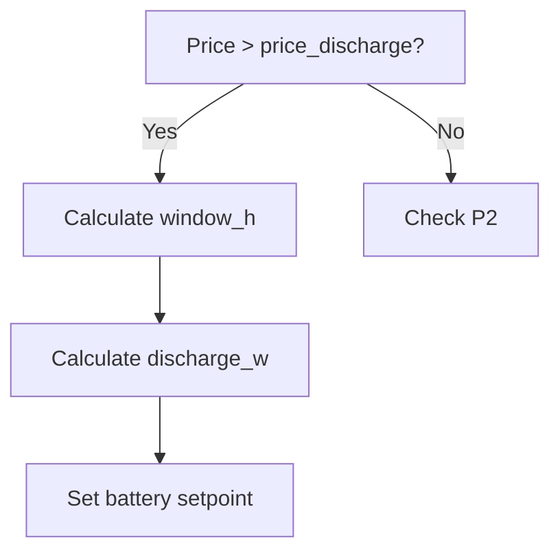

# SessyStrategy HA Documentation Plan
*Following Diátaxis Methodology | Total Estimated Effort: ~20-25 hours*

---

## 🎯 Objectives

1. Create **24 documentation files** across 4 Diátaxis categories
2. Extract and reorganize content from existing `README.md`
3. Add new explanatory and reference material
4. Establish cross-links between documents
5. Update the root `README.md` as a navigation hub

---

## 📅 Phase Overview

| Phase | Focus | Documents | Effort | Priority | Dependencies |
|-------|-------|------------|--------|----------|--------------|
| **1. Infrastructure** | Setup, templates, navigation | 3 | 2-3h | ⭐⭐⭐ | None |
| **2. Reference** | Technical details, configuration | 7 | 6-8h | ⭐⭐⭐ | Phase 1 |
| **3. Explanation** | Concepts, rationale | 6 | 5-6h | ⭐⭐⭐ | Phase 2 |
| **4. How-to** | Problem-solving guides | 6 | 4-5h | ⭐⭐ | Phase 2-3 |
| **5. Tutorials** | End-to-end guides | 3 | 3-4h | ⭐⭐ | Phase 2-4 |
| **6. Polish** | Cross-links, validation, README | 1 | 2-3h | ⭐ | All phases |

---

## 📌 Phase 1: Infrastructure Setup *(2-3 hours)*

### 📁 Tasks

| # | Task | Details | Notes |
|---|------|---------|-------|
| 1.1 | Create `docs/` directory structure | `docs/{tutorials,how-to,explanation,reference}` | Use lowercase, hyphenated names |
| 1.2 | Create `docs/_templates/` | Markdown templates for each doc type | Include frontmatter, consistent styling |
| 1.3 | Create `docs/index.md` | Landing page with Diátaxis navigation | Link to all 4 categories |
| 1.4 | Set up `.gitignore` for docs | Exclude temporary files | Add `docs/_build/`, `*.swp` |
| 1.5 | Create `docs/_sidebar.yml` (optional) | For future static site generation | MkDocs compatible |

### 📄 Deliverables

```
docs/
├── _templates/
│   ├── tutorial-template.md
│   ├── how-to-template.md
│   ├── explanation-template.md
│   └── reference-template.md
├── index.md
└── .gitignore
```

### ✅ Quality Criteria

- [ ] Directory structure matches proposed architecture
- [ ] Templates include consistent headers, footers, cross-link placeholders
- [ ] `index.md` has working relative links to all categories
- [ ] No broken links in navigation

---

## 📌 Phase 2: Reference Documentation *(6-8 hours)*
*Highest ROI - most frequently consulted*

### 📁 Tasks & Content Outline

| # | Document | Source | Sections | Effort | Priority |
|---|----------|--------|----------|--------|----------|
| 2.1 | `reference/configuration/apps-yaml.md` | Existing README §6, code comments | **Overview**, **Required vs Optional**, **All Tunables (table)**, **Examples** | 2h | ⭐⭐⭐ |
| 2.2 | `reference/entity-reference.md` | README §7, code `self.args.get()` | **Required Entities**, **Optional Entities**, **Created Entities**, **Entity Types** | 1.5h | ⭐⭐⭐ |
| 2.3 | `reference/live-tuning-entities.md` | Code `*_entity` args | **Purpose**, **Setup Instructions**, **Entity Table (Name, Type, Range, Default, Description)**, **Usage Example** | 1h | ⭐⭐⭐ |
| 2.4 | `reference/status-sensor-attributes.md` | `_publish_status()` method | **Complete Attribute List**, **Types**, **Examples**, **When Updated** | 1h | ⭐⭐⭐ |
| 2.5 | `reference/service-calls.md` | `_set_*()` methods | **Services Used**, **When Called**, **Parameters**, **Examples** | 0.5h | ⭐⭐ |
| 2.6 | `reference/architecture.md` | Code structure | **AppDaemon Lifecycle**, **Callbacks**, **Timer Management**, **Class Diagram** | 1h | ⭐⭐ |
| 2.7 | `reference/algorithms.md` | Helper methods | **Formulas (charge, discharge, spread)**, **Examples with Numbers**, **Edge Cases** | 1.5h | ⭐⭐⭐ |

### 📋 Content Details

#### 2.1 `apps-yaml.md` Structure

```markdown
# Configuration Reference — apps.yaml

## Overview
- Purpose of configuration
- How to apply changes (restart required?)

## Configuration Table

| Key | Type | Default | Required | Description | Valid Range |
|-----|------|---------|----------|-------------|-------------|
| capacity_wh | float | 5000 | Yes | Battery capacity in watt-hours | >0 |
| max_power_w | float | 2200 | Yes | Maximum inverter power | >0 |
| ... | ... | ... | ... | ... | ... |

## Configuration Examples
- Minimal configuration
- Full configuration with all overrides
- Seasonal override example
```

#### 2.2 `entity-reference.md` Structure

```markdown
# Entity Reference

## Required Entities (must exist)
| Entity | Type | Purpose | Example |
|--------|------|---------|---------|
| soc_sensor | sensor | Current battery SOC | sensor.sessy_battery_alt9_state_of_charge |
| price_sensor | sensor | Current energy price | sensor.sessy_dnhh_energy_price |
| ... | ... | ... | ... |

## Optional Entities
| Entity | Type | Purpose | Default Behavior if Unset |
|--------|------|---------|----------------------------|
| mode_select | input_select | Operating mode | Uses "optimized" |
| ... | ... | ... | ... |

## Entities Created by the App
- `sensor.sessy_strategy_status` (with attributes)
```

### ✅ Quality Criteria

- [ ] Every tunable from code is documented
- [ ] Every entity reference from code is included
- [ ] Tables are complete and accurate
- [ ] Examples are copy-pasteable
- [ ] No information from code comments is missing

---

## 📌 Phase 3: Explanation Documentation *(5-6 hours)*
*Clarifies the "why" behind the "how"*

### 📁 Tasks & Content Outline

| # | Document | Source | Sections | Effort | Priority |
|---|----------|--------|----------|--------|----------|
| 3.1 | `explanation/strategy-priority-chain.md` | README §1, code logic | **Overview**, **Priority 1-5 Deep Dive**, **Decision Flow Diagram**, **Why This Order?** | 1.5h | ⭐⭐⭐ |
| 3.2 | `explanation/price-basis-raw-vs-import.md` | README §34-42, code | **Raw vs Import Definitions**, **Surcharge Explanation**, **Threshold Rationale**, **Comparison Table** | 1h | ⭐⭐⭐ |
| 3.3 | `explanation/adaptive-spread-windows.md` | `_spread_window_h()`, `_contiguous_price_hours()` | **Purpose**, **Algorithm**, **Efficiency Benefits**, **Examples**, **min_window_h Impact** | 1h | ⭐⭐⭐ |
| 3.4 | `explanation/setpoint-types-explained.md` | README §2, code | **api vs nom Modes**, **When Each is Used**, **Control Philosophy**, **Pros/Cons**, **Mermaid Diagram** | 1h | ⭐⭐⭐ |
| 3.5 | `explanation/seasonal-operation.md` | Season mode code | **Modes (auto/summer/winter)**, **Inference Logic**, **Override Behavior**, **Daylight Detection**, **Fallback Logic** | 1h | ⭐⭐ |
| 3.6 | `explanation/arbitrage-margin.md` | Pre-peak logic | **Purpose of min_arbitrage_margin**, **Break-even Calculation**, **When Charging is Profitable**, **Example Scenarios** | 0.5h | ⭐⭐ |

### 📋 Content Details

#### 3.1 `strategy-priority-chain.md` Structure

```markdown
# Strategy Priority Chain

## Overview
- Top-down evaluation
- First match wins
- Self-correcting behavior

## Priority 1: Price-Spike Discharge
### When It Triggers
- Condition: `price > price_discharge`
- Example: price = €0.50, threshold = €0.39

### What It Does
- Battery setpoint (api mode)
- Discharge toward SOC floor
- Spread over adaptive window

### Why It's #1
- Highest value: avoid expensive imports
- Simple logic captures most benefit

### Diagram


## Priority 2: Cheap/Negative Price Charge
... (similar structure)

## Priority 3: Pre-Peak Charge Window
... (include arbitrage margin logic)

## Priority 4: Evening Peak Excess Discharge
... (new - from code)

## Priority 5: Default
... (grid setpoint 0W)
```

#### 3.4 `setpoint-types-explained.md` Structure

```markdown
# Setpoint Types Explained

## Overview
- Two control modes: battery setpoint vs grid setpoint
- Selected via Sessy's power_strategy option

## Battery Setpoint (api mode)
### What It Means
- Direct battery power control
- Positive = discharge, Negative = charge

### When Used
- Priority 1: Price-spike discharge
- Priority 2: Cheap charge
- Priority 3: Pre-peak charge

### Pros and Cons
- ✅ Precise battery control
- ❌ Grid balance is automatic

## Grid Setpoint (nom mode)
### What It Means
- Grid meter target
- Positive = import, Negative = export

### When Used
- Priority 4: Evening peak excess
- Priority 5: Default (0W)
- Manual grid_setpoint mode

### Pros and Cons
- ✅ Battery handles the rest
- ❌ Less direct control

## Control Philosophy
- Use battery setpoint when we want to control the battery directly
- Use grid setpoint when we want to control grid interaction
```

### ✅ Quality Criteria

- [ ] Each priority has: trigger condition, action, rationale, example
- [ ] Diagrams are clear and accurate
- [ ] Concepts are explained at appropriate depth
- [ ] Links to relevant reference docs (tunables, entities)
- [ ] Mathematical reasoning is sound

---

## 📌 Phase 4: How-to Guides *(4-5 hours)*
*Practical, problem-solving*

### 📁 Tasks & Content Outline

| # | Document | Problem | Solution Sections | Effort | Priority |
|---|----------|---------|-------------------|--------|----------|
| 4.1 | `how-to/configure-seasonal-mode.md` | "I want winter/summer behavior" | **Understanding Modes**, **Setting in apps.yaml**, **Using season_mode_entity**, **Testing**, **Troubleshooting** | 1h | ⭐⭐⭐ |
| 4.2 | `how-to/tune-price-thresholds.md` | "How do I change charge/discharge prices?" | **Understanding Thresholds**, **Calculating Your Values**, **Setting in apps.yaml**, **Using Live Entities**, **Verifying Changes** | 1h | ⭐⭐⭐ |
| 4.3 | `how-to/override-manual-mode.md` | "I need to force a setpoint" | **Mode Options**, **grid_setpoint Mode**, **battery_setpoint Mode**, **When to Use Each**, **Automatic Resume** | 0.75h | ⭐⭐ |
| 4.4 | `how-to/add-live-tuning-helpers.md` | "I want to tweak without restarting" | **Available Helpers**, **Creating input_number Entities**, **Linking to App**, **HA UI Example**, **Testing** | 1h | ⭐⭐ |
| 4.5 | `how-to/debug-strategy-decisions.md` | "Why didn't it charge when I expected?" | **Checking Status Sensor**, **Reading Logs**, **Understanding Priority Chain**, **Common Issues**, **Advanced Debugging** | 1h | ⭐⭐⭐ |
| 4.6 | `how-to/migrate-from-older-version.md` | "I'm upgrading from vX" | **Breaking Changes**, **Configuration Migration**, **New Features**, **Testing Migration** | 0.5h | ⭐ |

### 📋 Content Details

#### 4.2 `tune-price-thresholds.md` Structure

```markdown
# Tune Price Thresholds

## Understanding Price Thresholds

### price_discharge
- **Purpose**: Trigger for selling stored energy
- **Default**: €0.39/kWh (raw)
- **Import equivalent**: €0.50/kWh (raw + €0.11 surcharge)

### price_charge
- **Purpose**: Trigger for buying cheap energy
- **Default**: -€0.10/kWh (raw)
- **Import equivalent**: €0.01/kWh

## Calculating Your Values

### Step 1: Know Your Surcharge
```yaml
surcharge: 0.11  # Default Dutch energy tax
```

### Step 2: Determine Your Break-Even
- **Discharge**: When grid import price > your value
- **Charge**: When grid export price < your cost

### Step 3: Set Thresholds
```yaml
# Example for high energy costs
price_discharge: 0.45   # Discharge when raw > €0.45
price_charge: -0.15     # Charge when raw < -€0.15
```

## Setting in apps.yaml
```yaml
sessy_strategy:
  module: sessy_strategy
  class: SessyStrategy
  price_discharge: 0.45
  price_charge: -0.15
  surcharge: 0.11
```

## Using Live Entities (No Restart)
1. Create input_number helpers
2. Link to app via entity IDs
3. Change values in HA UI

## Verifying Changes
- Check logs for new threshold values
- Monitor status sensor attributes
- Observe strategy behavior
```

#### 4.5 `debug-strategy-decisions.md` Structure

```markdown
# Debug Strategy Decisions

## Quick Check: Status Sensor
The `sensor.sessy_strategy_status` entity contains:
- `active_branch`: Which priority matched
- All current values: SOC, prices, thresholds, season

## Reading the Logs
Log format:
```
Hour=14  SOC=65%  Raw price=0.25000  Import price=0.36000
DEFAULT: grid setpoint 0W — absorb solar, block export
```

### Understanding Priority Chain
1. Check if P1 condition was met
2. If not, check P2
3. Continue down to P5

## Common Issues

### "It's not charging during cheap hours"
- [ ] Is `price_charge` set correctly?
- [ ] Is current price < `price_charge`?
- [ ] Is SOC < `cheap_soc_target`?
- [ ] Are price entities available?

### "It's not discharging during peak"
- [ ] Is `price_discharge` set correctly?
- [ ] Is current price > `price_discharge`?
- [ ] Is SOC > `soc_floor`?

## Advanced Debugging
- Enable debug logging in AppDaemon
- Check price sensor attributes
- Verify SOC sensor accuracy
```

### ✅ Quality Criteria

- [ ] Each guide solves a specific, common problem
- [ ] Steps are actionable and verified
- [ ] Includes troubleshooting section
- [ ] Links to relevant reference and explanation docs
- [ ] Examples are realistic

---

## 📌 Phase 5: Tutorials *(3-4 hours)*
*End-to-end learning*

### 📁 Tasks & Content Outline

| # | Document | Audience | Sections | Effort | Priority |
|---|----------|----------|----------|--------|----------|
| 5.1 | `tutorials/getting-started.md` | New users | **Prerequisites**, **Installation**, **Configuration**, **First Run**, **Verification**, **Next Steps** | 1.5h | ⭐⭐⭐ |
| 5.2 | `tutorials/first-day-operation.md` | New users | **What to Expect**, **Morning Behavior**, **Afternoon Pre-Peak**, **Evening Peak**, **Night Behavior**, **Checking Status** | 1h | ⭐⭐ |
| 5.3 | `tutorials/dashboard-setup.md` | Dashboard users | **Prerequisites**, **Status Card**, **Price Chart**, **SOC Chart**, **Setpoint Chart**, **Combined Dashboard**, **Example YAML** | 1h | ⭐ |

### 📋 Content Details

#### 5.1 `getting-started.md` Structure

```markdown
# Getting Started with SessyStrategy HA

## Prerequisites
- Home Assistant (tested on 2024.6+)
- AppDaemon (4.x+)
- Sessy integration installed
- Dynamic energy price sensor (e.g., ha-dsmr, Nordic Energy)

## Step 1: Install AppDaemon
```bash
# Install via HACS or manually
```

## Step 2: Copy Files
```bash
# Copy sessy_strategy.py to your AppDaemon apps directory
cp files/sessy_strategy.py /config/appdaemon/apps/
```

## Step 3: Configure apps.yaml
Minimal configuration:
```yaml
sessy_strategy:
  module: sessy_strategy
  class: SessyStrategy
  # Required entities (update to match your setup)
  soc_sensor: sensor.your_battery_soc
  price_sensor: sensor.your_energy_price
```

Full configuration example:
```yaml
sessy_strategy:
  module: sessy_strategy
  class: SessyStrategy
  # Battery specs
  capacity_wh: 10000
  max_power_w: 3500
  # ... all other tunables
```

## Step 4: Verify Entities
Check that these entities exist:
- `sensor.sessy_strategy_status` (created by app)
- Your SOC sensor
- Your price sensor

## Step 5: First Run
- Restart AppDaemon
- Check logs for startup message
- Verify first strategy decision

## Step 6: Monitor
- Watch `sensor.sessy_strategy_status` attributes
- Check logs for decisions
- Observe battery behavior

## Next Steps
- [Tune price thresholds](how-to/tune-price-thresholds.md)
- [Set up live tuning](how-to/add-live-tuning-helpers.md)
- [Create a dashboard](tutorials/dashboard-setup.md)
```

#### 5.3 `dashboard-setup.md` Structure

```markdown
# Dashboard Setup with ApexCharts

## Prerequisites
- ApexCharts card installed
- SessyStrategy running

## Step 1: Status Card
Simple entity card for strategy status:
```yaml
type: entity
entity: sensor.sessy_strategy_status
```

## Step 2: Price Chart
```yaml
type: custom:apexcharts-card
series:
  - entity: sensor.sessy_dnhh_energy_price
    name: Energy Price
    type: line
    group_by:
      func: avg
      duration: 1h
```

## Step 3: SOC Chart
```yaml
type: custom:apexcharts-card
series:
  - entity: sensor.sessy_battery_alt9_state_of_charge
    name: Battery SOC
    type: line
```

## Step 4: Combined Dashboard
Full example with all charts and status:
```yaml
# Complete dashboard YAML
```

## Tips
- Use `state-card-value` for clean numeric display
- Add thresholds as horizontal lines
- Color code by strategy branch
```

### ✅ Quality Criteria

- [ ] Steps are verified and work end-to-end
- [ ] Assumes minimal prior knowledge
- [ ] Includes screenshots or diagrams where helpful
- [ ] Links to relevant how-to and reference docs
- [ ] Troubleshooting tips included

---

## 📌 Phase 6: Polish & Finalization *(2-3 hours)*

### 📁 Tasks

| # | Task | Details | Effort |
|---|------|---------|--------|
| 6.1 | Add cross-links between documents | Ensure all mentioned concepts link to their docs | 1h |
| 6.2 | Validate all examples | Test YAML, check code references | 0.5h |
| 6.3 | Create `docs/README.md` | Alternative entry point | 0.5h |
| 6.4 | Update root `README.md` | Replace with navigation hub | 0.5h |
| 6.5 | Proofread all documents | Check for consistency, typos | 0.5h |
| 6.6 | Add version metadata | Frontmatter with creation date, last updated | 0.5h |
| 6.7 | Create `docs/.gitattributes` | Line ending consistency | 0.25h |
| 6.8 | Final validation | Check all links, verify completeness | 0.5h |

### 📄 Updated Root README.md

```markdown
# SessyStrategy HA

**Smart battery charging strategy for Home Assistant + Sessy**

[](LICENSE)
[](https://appdaemon.readthedocs.io)

---

## 📚 Documentation (Diátaxis)

| Category | Purpose | Documents |
|----------|---------|-----------|
| **📚 Tutorials** | *Learning-oriented* — Follow along step-by-step | [Getting Started](docs/tutorials/getting-started.md) • [First Day](docs/tutorials/first-day-operation.md) • [Dashboard Setup](docs/tutorials/dashboard-setup.md) |
| **🛠️ How-to** | *Problem-oriented* — Solve specific problems | [Tune Thresholds](docs/how-to/tune-price-thresholds.md) • [Debug Decisions](docs/how-to/debug-strategy-decisions.md) • [Configure Seasons](docs/how-to/configure-seasonal-mode.md) • [Manual Override](docs/how-to/override-manual-mode.md) • [Live Tuning](docs/how-to/add-live-tuning-helpers.md) • [Migration Guide](docs/how-to/migrate-from-older-version.md) |
| **💡 Explanation** | *Understanding-oriented* — Learn the concepts | [Priority Chain](docs/explanation/strategy-priority-chain.md) • [Price Basis](docs/explanation/price-basis-raw-vs-import.md) • [Spread Windows](docs/explanation/adaptive-spread-windows.md) • [Setpoint Types](docs/explanation/setpoint-types-explained.md) • [Seasonal Op](docs/explanation/seasonal-operation.md) • [Arbitrage Margin](docs/explanation/arbitrage-margin.md) |
| **📖 Reference** | *Information-oriented* — Look up technical details | [apps.yaml](docs/reference/configuration/apps-yaml.md) • [Entities](docs/reference/entity-reference.md) • [Live Entities](docs/reference/live-tuning-entities.md) • [Status Attributes](docs/reference/status-sensor-attributes.md) • [Service Calls](docs/reference/service-calls.md) • [Architecture](docs/reference/architecture.md) • [Algorithms](docs/reference/algorithms.md) |

---

## ⚡ Quick Start

1. **Install**: Copy `files/sessy_strategy.py` to your AppDaemon apps directory
2. **Configure**: Add configuration to `apps.yaml` (see [Configuration Reference](docs/reference/configuration/apps-yaml.md))
3. **Run**: Restart AppDaemon
4. **Verify**: Check `sensor.sessy_strategy_status`

👉 [Full Getting Started Guide](docs/tutorials/getting-started.md)

---

## 🤝 Contributing

See [CONTRIBUTING.md](CONTRIBUTING.md)

## 📄 License

[MIT](LICENSE)
```

### ✅ Quality Criteria

- [ ] All internal links work
- [ ] No broken external links
- [ ] Consistent styling across all documents
- [ ] Root README clearly directs to new docs
- [ ] Documentation is complete (all proposed docs exist)

---

## 📊 Effort Estimation Summary

| Category | # Docs | Hours | % of Total |
|----------|--------|-------|------------|
| Infrastructure | 5 files | 2-3 | 10-12% |
| Reference | 7 docs | 6-8 | 25-32% |
| Explanation | 6 docs | 5-6 | 20-25% |
| How-to | 6 docs | 4-5 | 16-20% |
| Tutorials | 3 docs | 3-4 | 12-16% |
| Polish | 8 tasks | 2-3 | 8-12% |
| **Total** | **24 docs + 8 tasks** | **20-25** | **100%** |

---

## 🚀 Execution Timeline (Suggested)

### Option A: Sequential (Recommended for Solo)

| Week | Phase | Output |
|------|-------|--------|
| Week 1 | Phase 1 + 2 | Infrastructure + Reference docs |
| Week 2 | Phase 3 + 4 | Explanation + How-to docs |
| Week 3 | Phase 5 + 6 | Tutorials + Polish |

### Option B: Parallel (Team)

| Person | Phases | Focus |
|--------|--------|-------|
| Person 1 | Phase 1, 2 | Infrastructure + Reference |
| Person 2 | Phase 3, 5 | Explanation + Tutorials |
| Person 3 | Phase 4, 6 | How-to + Polish |

### Option C: Incremental (Minimum Viable Docs)

1. **Week 1**: Infrastructure + Reference (highest immediate value)
2. **Week 2**: Explanation (answers "why?")
3. **Week 3**: How-to + Tutorials (user-facing)
4. **Week 4**: Polish

---

## 🎯 Success Criteria

### ✅ Must Have

- [ ] All 24 documents created
- [ ] All tunables from code are documented
- [ ] All entities from code are documented
- [ ] Priority chain fully explained
- [ ] Root README updated as navigation hub
- [ ] All internal links work
- [ ] Consistent formatting and style

### 🌟 Should Have

- [ ] Diagrams in explanation docs (Mermaid)
- [ ] Examples in all reference docs
- [ ] Troubleshooting in all how-to docs
- [ ] Cross-links between related docs
- [ ] Version metadata in all docs

### ✨ Nice to Have

- [ ] Static site generation (MkDocs)
- [ ] PDF export
- [ ] Search functionality
- [ ] User feedback mechanism
- [ ] Contribution guide for docs

---

## 📝 Next Steps

1. **Approve this plan** — Confirm scope, priorities, and approach
2. **Assign owners** — Who writes which documents?
3. **Set up infrastructure** — Create `docs/` structure and templates
4. **Begin Phase 2** — Start with Reference docs (highest ROI)
5. **Establish review process** — How will docs be reviewed for accuracy?

---

## 📚 Proposed Documentation Architecture

For reference, the target structure is:

```
docs/
├── 📚 tutorials/
│   ├── getting-started.md
│   ├── first-day-operation.md
│   └── dashboard-setup.md
│
├── 🛠️ how-to/
│   ├── configure-seasonal-mode.md
│   ├── tune-price-thresholds.md
│   ├── override-manual-mode.md
│   ├── add-live-tuning-helpers.md
│   ├── debug-strategy-decisions.md
│   └── migrate-from-older-version.md
│
├── 💡 explanation/
│   ├── strategy-priority-chain.md
│   ├── price-basis-raw-vs-import.md
│   ├── adaptive-spread-windows.md
│   ├── setpoint-types-explained.md
│   ├── seasonal-operation.md
│   └── arbitrage-margin.md
│
└── 📖 reference/
    ├── configuration/
    │   └── apps-yaml.md
    ├── entity-reference.md
    ├── live-tuning-entities.md
    ├── status-sensor-attributes.md
    ├── service-calls.md
    ├── architecture.md
    └── algorithms.md
```

---

*Plan created: 2026-08-01 | Methodology: [Diátaxis](https://diataxis.fr/)*
