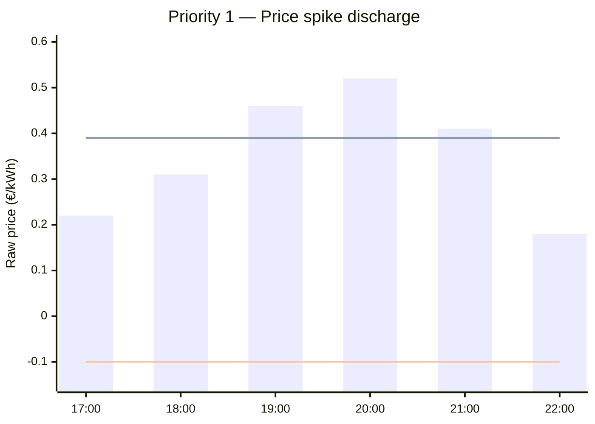
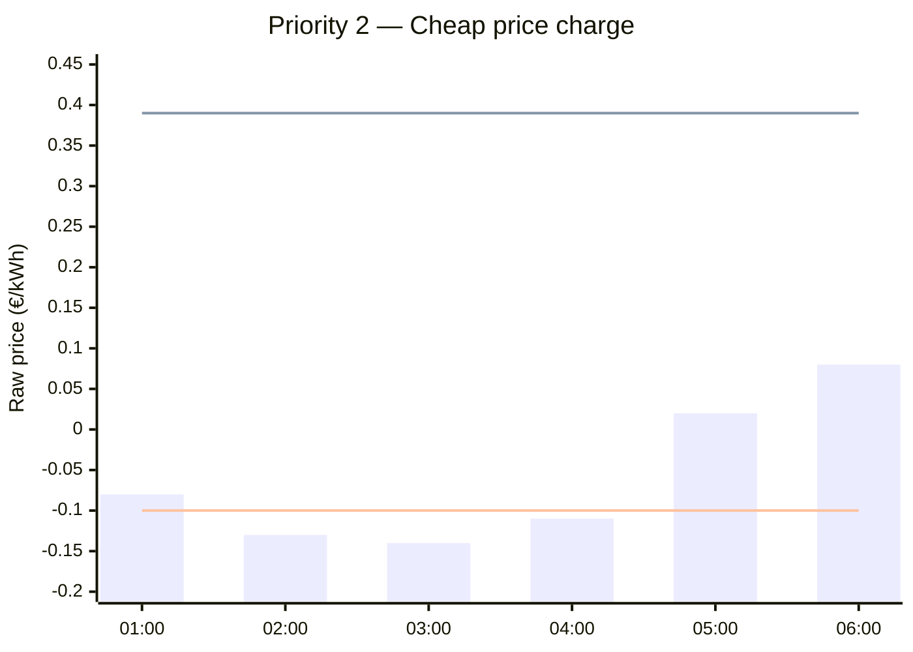
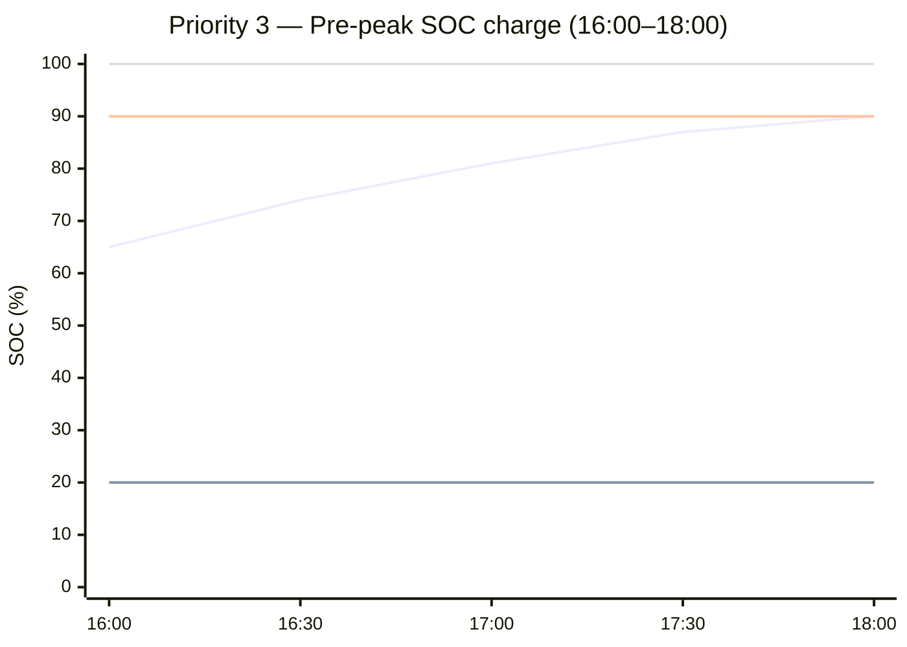
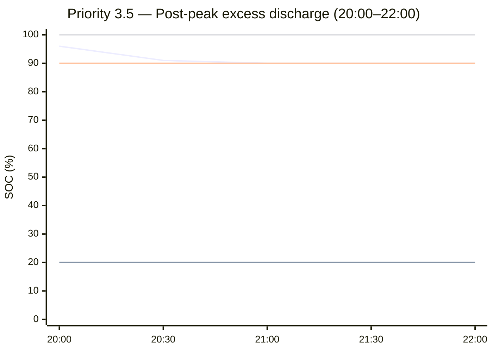
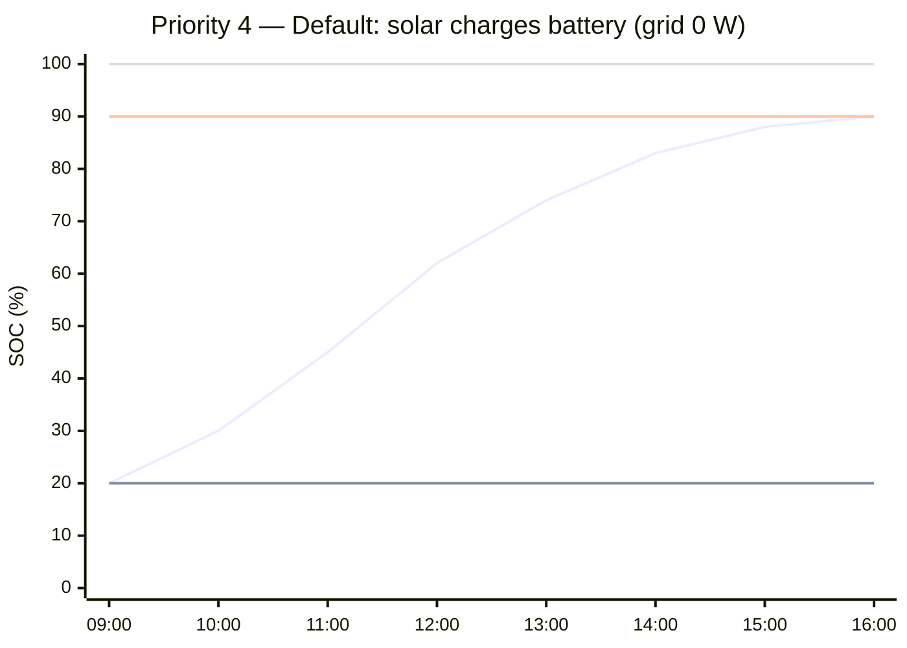
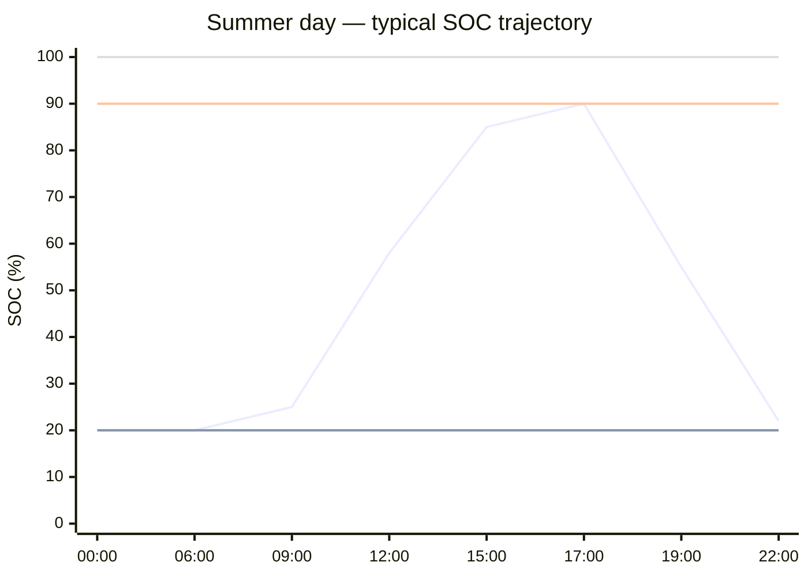
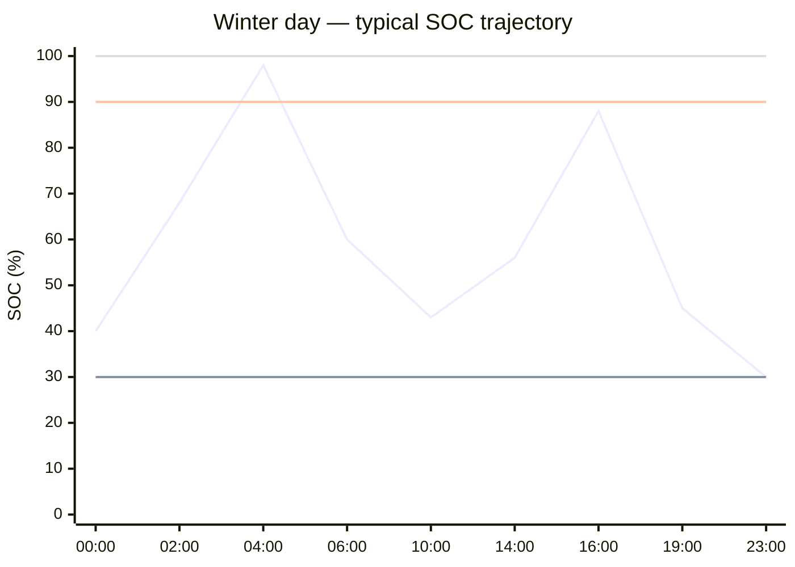

# Sessy Battery Strategy — Home Assistant Integration

An AppDaemon-based charging strategy for the Sessy home battery that minimises solar export, avoids expensive grid imports, and captures value during extreme price events — all automatically, based on real-time dynamic energy prices.

---

## Table of contents

1. [How the strategy works](#1-how-the-strategy-works)
2. [Setpoint types explained](#2-setpoint-types-explained)
3. [Summer operation example](#3-summer-operation-example)
4. [Winter operation example](#4-winter-operation-example)
5. [Installation](#5-installation)
6. [Configuration reference](#6-configuration-reference)
7. [Entity reference](#7-entity-reference)
8. [Home battery package (modes & controls)](#8-home-battery-package-modes--controls)
9. [ApexCharts dashboard](#9-apexcharts-dashboard)
10. [Troubleshooting](#10-troubleshooting)

---

## 1. How the strategy works

The app wakes every 5 minutes, reads the current state of charge (SOC) and the live energy price, and runs a single **top-down priority chain**. The first branch whose condition matches wins, sets the battery for that cycle, and stops; everything below it is skipped. If nothing matches, the default branch runs. Nothing is stored between cycles — the decision is recomputed from scratch each run, so it behaves like a proportional controller that self-corrects as SOC and prices move.

```
Priority 1   — Price spike       → discharge toward SOC floor
Priority 2   — Cheap / negative  → charge toward 100% SOC
Priority 3   — Pre-peak window   → charge toward 70% SOC (16–18 h, only if the peak pays)
Priority 3.5 — Post-peak surplus → bleed excess SOC back to target (20–22 h)
Priority 4   — Default           → grid setpoint 0 W (absorb PV, block export)
```

### Price basis: raw vs. import

The Sessy integration exposes **raw export prices** (what the grid pays you). Your consumer **import price** is raw + €0.11/kWh surcharge (energy tax). Every threshold below is expressed as a raw price:

| Condition | Raw price | Import equivalent |
|---|---|---|
| Discharge override (P1) | > €0.39/kWh | > €0.50/kWh |
| Cheap charge (P2) | < −€0.10/kWh | < €0.01/kWh |

### Mechanics shared by every branch

- **Control mode** (full detail in [§2](#2-setpoint-types-explained)): the price-spike discharge and the charge branches drive the **battery setpoint** (`api` mode — exact battery power, grid balances); the default and the post-peak surplus sale drive the **grid setpoint** (`nom` mode — meter target).
- **Proportional spread + caps.** Active power is the SOC gap spread over a time window, then capped at 40 % C-rate (2,000 W on a 5 kWh pack) and the 2,200 W hardware limit:

  ```
  charge    (W) = (SOC_target − SOC) / 100 × capacity_Wh / window_h
  discharge (W) = (SOC − SOC_floor)  / 100 × capacity_Wh / window_h
  ```

  Partial power is deliberate: inverter copper losses scale with the square of current, so half power is roughly 4× more efficient per watt, and a gentle charge leaves headroom for residual PV to fill the gap instead of the grid.

---

### Priority 1 — Price-spike discharge

**What it does.** During an extreme price hour, the battery feeds the house and offsets grid import, so you ride out the spike on stored energy instead of buying at the peak.

**Trigger.** Raw price > `price_discharge` (€0.39 → €0.50 import).

**Battery steering.** Battery setpoint (`api`), positive = discharge:

```
discharge (W) = (SOC − soc_floor) / 100 × capacity_Wh / discharge_window_h   (capped)
```

`discharge_window_h` (2 h) is only a **rate-sizing window**, not a duration commitment: it sets how hard to discharge *this* cycle so the battery drains gently rather than dumping at full power. The branch is re-evaluated every 5 minutes against the live price, so **discharge lasts exactly as long as the price stays above the threshold** — when the spike ends the branch stops firing and the chain falls through (usually to the 0 W default), leaving any remaining energy above the floor untouched. `soc_floor` (20 %, winter 30 %) is the lower bound that zeroes the setpoint while the branch is active, not a level the strategy commits to reaching. The orange line marks the discharge trigger.



**Rationale.** The single most valuable thing a home battery can do is avoid the most expensive kWh of the day, so this sits at the top of the chain. **Lean:** one price comparison captures essentially all of that value — no forecasting, no optimiser — and the 2-hour spread keeps the inverter in its efficient band across the typical width of an evening peak.

---

### Priority 2 — Cheap / negative-price charge

**What it does.** When power is almost free — or you are paid to take it — fill the battery from the grid so that cheap energy covers later, pricier hours.

**Trigger.** Raw price < `price_charge` (−€0.10). If SOC is already at `cheap_soc_target` (100 %), it simply holds at grid 0 W.

**Battery steering.** Battery setpoint (`api`), negative = charge:

```
charge (W) = (cheap_soc_target − SOC) / 100 × capacity_Wh / cheap_hours_remaining   (capped)
```

`cheap_hours_remaining` is the count of consecutive upcoming hours still below the threshold, so a single-hour dip charges hard to grab it while a long cheap block charges gently. The green line marks the charge trigger.



**Rationale.** Cheap power is upside — every stored kWh saves money twice (cheap in, expensive avoided later). The branch earns its keep mainly **in winter**, when deeply negative prices essentially never occur but ordinary cheap prices show up *overnight* — exactly when there is no PV and the battery should be filled from the grid for the day ahead.

**Lean:** counting the cheap run is a single loop over price data the integration already provides — no price prediction, no degradation model — and recomputing every 5 minutes lets the rate self-correct as the window shrinks. We deliberately do **not** chase the rare summer extreme-negative event (e.g. −€0.50): truly maximising that would mean pre-emptively dumping stored energy beforehand and curtailing the PV that is generating at full tilt at exactly that time, then charging at max rate — a far more complex strategy whose payoff is too rare to justify the added moving parts. Capturing the everyday cheap hours with one threshold is the lean 90 % of the value.

---

### Priority 3 — Pre-peak SOC charge

**What it does.** Top the battery up to its evening target shortly before the peak — but *only* when that peak is expensive enough to be worth buying grid energy for.

**Trigger.** All of: inside the pre-peak window `prepeak_start`–`prepeak_end` (16–18 h, winter 14–18 h); SOC < `soc_target` (70 %); and the break-even guard passes —

```
expected_evening_peak_raw − import_price_now ≥ min_arbitrage_margin (€0.05)
```

where `expected_peak_raw` is the highest raw price from the current hour until end of day. If SOC is already at target, or the spread is too thin, it falls through to grid 0 W.

**Battery steering.** Battery setpoint (`api`), negative = charge, spread over `prepeak_window_h` (2 h, winter 4 h):

```
charge (W) = (soc_target − SOC) / 100 × capacity_Wh / prepeak_window_h   (capped)
```

The blue line marks the SOC target.



**Rationale.** On dull days solar cannot fill the battery, so a small grid top-up is the only way to have stored energy ready for the evening. The break-even guard is the restraint that matters: buying at €0.46 to discharge at €0.47 just churns the battery for nothing. **Lean:** one max-lookup over the day's prices avoids that trap without a full arbitrage optimiser.

---

### Priority 3.5 — Post-peak excess discharge

**What it does.** If the peak passes and the battery is still above target with no further spike coming, bleed the surplus back down to target so you don't end the night holding energy you bought for a peak that's already over.

**Trigger.** Inside `evening_peak_start`–`evening_peak_end` (20–22 h); SOC > `soc_target` (70 %); and no remaining hour today exceeds `price_discharge` (no spike left to save it for).

**Grid steering.** Grid setpoint (`nom`), negative = export — we want to *sell* the surplus. The magnitude is spread over the hours left in the evening window:

```
grid setpoint (W) = −(SOC − soc_target) / 100 × capacity_Wh / hours_until_peak_end   (capped)
```

Using the grid setpoint (not the battery setpoint) means the battery covers household load **on top of** the export target, so a high home load makes the battery work harder rather than importing from the grid. The blue line marks the discharge destination.



**Rationale.** Holding charge past target only pays if a bigger peak is still ahead; once the schedule says it isn't, that energy is worth more used now than carried overnight. **Lean:** a single scan of the remaining prices is cheap insurance against ending the day overcharged.

---

### Priority 4 — Default: grid setpoint 0 W

**What it does.** Whenever no price condition fires, keep the meter at zero: all PV goes into the battery first, and grid export is blocked until the battery is full.

**Trigger.** None of the above — the fall-through that covers the bulk of the day.

**Grid steering.** Grid setpoint (`nom`) fixed at 0 W. No formula: the battery absorbs whatever PV exceeds household load, and the grid covers any shortfall.



**Rationale.** Exporting solar and reimporting it later pays the €0.11/kWh surcharge twice; holding the meter at 0 W kills that round-trip loss and prioritises self-consumption — almost always the cheapest kWh available. **Lean:** it is the safe do-no-harm default, so the chain only ever leaves it for a concrete, priced reason.

---

## 2. Setpoint types explained

The Sessy supports two control modes, switched via `select.sessy_battery_alt9_power_strategy`:

### `nom` — Grid setpoint (strategy = nom)

Controls the power at the **grid connection**. The battery responds to keep the meter at the target value. PV generation is consumed by the house first; the battery covers any remaining gap or absorbs surplus.

- Set via: `number.sessy_pwkn_grid_target` (W, positive = import, negative = export)
- Used for: default 0W operation
- Effect of 0W: all PV is forced into the battery; export is blocked until battery is full

### `api` — Battery setpoint (strategy = api)

Controls the **battery charge/discharge power** directly. The grid covers any mismatch between battery power and household load. PV generation still flows to the house and battery; grid covers the rest.

- Set via: `number.sessy_battery_alt9_power_setpoint` (W, negative = charge, positive = discharge)
- Used for: pre-peak SOC targeting, price-spike discharge, cheap-window charging
- Effect: battery runs at the exact specified power; grid acts as balancer

---

## 3. Summer operation example

**Conditions:** sunny day, PV production 1,500–2,000 W peak, 5 kWh battery

| Time | Price (raw) | Strategy | Setpoint | SOC | What happens |
|---|---|---|---|---|---|
| 00:00–06:00 | €0.05–0.08 | Grid | 0 W | ~20% | Battery rests. Grid covers night load. |
| 06:00–09:00 | €0.13–0.22 | Grid | 0 W | ~20% | No solar yet. Battery conserved. |
| 09:00–16:00 | €0.08–0.11 | Grid | 0 W | 20%→90% | PV rises. Grid setpoint 0W forces all PV into battery. No export. Battery fills by early afternoon on a good day. |
| 16:00–18:00 | €0.08–0.11 | Battery | −300–800 W | 85%→90% | If battery not yet full, spread charge from grid. Rate = (90−SOC)/100 × 5000 / 2. Residual PV still contributes. |
| 18:00–22:00 | €0.13–0.47 | Battery* | +1500 W | 90%→20% | Battery discharges to cover evening load. *If price > €0.39: discharge setpoint active. |
| 22:00–24:00 | €0.15–0.16 | Grid | 0 W | ~20% | Battery rests. Prices moderate, no action. |



**Example price-spike event (today's data, 20:00–21:00, raw €0.46):**

At 20:00 the raw price hits €0.46 (import €0.57), triggering the discharge override. With SOC at 80%:

```
available_Wh = (80 − 20) / 100 × 5000 = 3000 Wh
setpoint     = min(3000 / 2, 2000, 2200) = 1500 W discharge
```

The battery feeds 1,500 W back through the inverter, reducing grid import to near zero during the most expensive hour of the day.

---

## 4. Winter operation example

**Conditions:** low PV (200–600 W on good days), higher household load due to heating, no significant midday solar peak

In winter the strategy shifts significantly: solar cannot reliably fill the battery during the day, so the overnight cheap-price window becomes the primary charge opportunity.

| Time | Price (raw) | Strategy | Setpoint | SOC | What happens |
|---|---|---|---|---|---|
| 00:00–06:00 | €0.07–0.10 | Battery | 0 to −2200 W | 40%→100% | If price dips below −€0.10 (occasional in winter), charge toward 100% spread over the run of cheap hours. Otherwise rest. |
| 06:00–09:00 | €0.30–0.55 | Battery* | +1000–1500 W | 80%→45% | Morning heating load. *If price > €0.39: discharge override active, covers heating demand from battery. |
| 09:00–14:00 | €0.14–0.25 | Grid | 0 W | 45%→55% | Limited PV absorbed. Grid setpoint 0W prevents export of scarce winter solar. Grid covers remainder of load. |
| 14:00–16:00 | €0.16–0.22 | Grid | 0 W | 55%→60% | Prices rising. Continue absorbing any PV. |
| 16:00–18:00 | €0.35–0.52 | Battery | −750–1250 W | 60%→90% | Pre-peak charge. With lower starting SOC than summer, rate is higher. Watch total grid cost: buying at €0.46 import to discharge at €0.57 later only breaks even if the spike is sufficiently above the pre-peak price. |
| 18:00–23:00 | €0.48–0.68 | Battery* | +1250–1500 W | 90%→40% | Evening heating peak. Battery covers load. *Discharge override fires if price > €0.39. |
| 23:00–24:00 | €0.10–0.14 | Grid | 0 W | ~40% | Rest. Assess whether overnight cheap window will occur. |



**Winter-specific considerations:**

- The pre-peak window sometimes buys grid energy at €0.46+ import, only to discharge it at €0.57+ — a margin of €0.11, which is exactly the surcharge. In marginal cases this barely breaks even. Consider raising `PRICE_DISCHARGE` or narrowing `PREPEAK_START`/`PREPEAK_END` in winter months if prices are consistently high from 16:00 onward.
- The discharge floor `SOC_FLOOR = 20%` leaves 1 kWh in reserve. In cold weather with higher overnight heating loads, consider raising this to 30% so there is always a morning reserve.
- Sessy's own dynamic schedule (`sensor.sessy_dnhh_power_schedule`) is worth monitoring in winter — it can spot overnight cheap windows that the fixed threshold misses.

---

## 5. Installation

### Prerequisites

- Home Assistant with the [Sessy integration](https://github.com/PimDoos/ha-sessy) installed and configured
- [AppDaemon 4](https://appdaemon.readthedocs.io/) installed as a Home Assistant add-on (HAOS) or in a separate container (docker compose)

### Step 1 — Install AppDaemon

In Home Assistant, go to **Settings → Add-ons → Add-on store** and search for **AppDaemon 4**. Install and start it. Enable **Start on boot** and **Watchdog**.

### Step 2 — Copy the strategy file

Copy `sessy_strategy.py` to your AppDaemon apps directory. If you use the AppDaemon add-on, this is typically:

```
/config/appdaemon/apps/sessy_strategy.py
```

Via SSH or the Samba share, or using the File Editor add-on.

### Step 3 — Register and configure the app

Copy `apps.yaml` to `/config/appdaemon/apps/apps.yaml` (or merge its contents). At minimum, map the entity IDs to your own Sessy entities — the defaults use this author's entity suffixes (`alt9`, `dnhh`, `pwkn`) and will **not** match your installation:

```yaml
sessy_strategy:
  module: sessy_strategy
  class: SessyStrategy

  # Map these to your own Sessy entities:
  strategy_select: select.sessy_battery_<id>_power_strategy
  grid_target: number.sessy_<id>_grid_target
  battery_setpoint: number.sessy_battery_<id>_power_setpoint
  soc_sensor: sensor.sessy_battery_<id>_state_of_charge
  price_sensor: sensor.sessy_<id>_energy_price
```

All tunables (SOC targets, price thresholds, time windows) are optional and fall back to sensible defaults — see [Configuration reference](#6-configuration-reference) for the full list.

**Optional — Home Battery integration:** copy `files/custom_components/home_battery/` to `/config/custom_components/home_battery/`, restart Home Assistant, then add the **Home Battery** integration under Settings → Devices & Services. This creates a real Home Battery device that owns the mode selector, setpoint/SOC numbers, and mirror sensors (see [section 8](#8-home-battery-integration-modes--controls)).

**Optional — HA helpers:** enable `packages: !include_dir_named packages` in `configuration.yaml`, then copy into `/config/packages/`:

- `sessy_helpers.yaml` — `input_select.sessy_season_mode` (auto/summer/winter), the price-threshold sliders, and the legacy `input_boolean.sessy_strategy_enabled`.

Reference these in `apps.yaml` (`season_mode_entity:` and the price `*_entity` keys) to tune behavior from the HA UI without restarting AppDaemon.

### Step 4 — Verify AppDaemon configuration

Ensure `/config/appdaemon/appdaemon.yaml` contains your time zone and Home Assistant connection. A minimal example:

```yaml
appdaemon:
  time_zone: Europe/Amsterdam
  latitude: 52.0
  longitude: 5.1
  elevation: 0
  plugins:
    HASS:
      type: hass
      ha_url: http://homeassistant.local:8123
      token: YOUR_LONG_LIVED_ACCESS_TOKEN
```

Generate a long-lived access token in Home Assistant under **Profile → Long-lived access tokens**.

### Step 5 — Restart AppDaemon

Restart the AppDaemon add-on. Within a few seconds you should see log output in the AppDaemon log:

```
INFO sessy_strategy: Sessy strategy starting up
INFO sessy_strategy: Hour=14  SOC=72%  Raw price=0.02590  Import price=0.13590
INFO sessy_strategy: DEFAULT: grid setpoint 0W — absorb solar, block export
```

AppDaemon logs are accessible via **Settings → Add-ons → AppDaemon → Log**.

### Step 6 — Verify entity control

Check that the strategy is writing to the correct entities by watching the state of:

- `select.sessy_battery_alt9_power_strategy` — should switch between `nom` and `api`
- `number.sessy_pwkn_grid_target` — should show 0 during normal daytime operation
- `number.sessy_battery_alt9_power_setpoint` — should show a negative value during pre-peak charging

---

## 6. Configuration reference

All tunables and entity IDs are set as app arguments in `apps.yaml` — no need to edit the Python. Every value is optional except the entity IDs, which must match your installation. Defaults are shown below:

```yaml
sessy_strategy:
  module: sessy_strategy
  class: SessyStrategy

  capacity_wh: 5000          # Battery capacity in Wh
  max_power_w: 2200          # Inverter/battery max power in W
  c_rate_cap: 0.40           # Max C-rate for spread setpoints (0.40 = 40%)
  soc_target: 90             # % SOC to reach before the evening peak
  soc_floor: 20              # % SOC floor — never discharge below this
  cheap_soc_target: 100      # % SOC ceiling for cheap-price charging
  surcharge: 0.11            # Import surcharge €/kWh (raw export → import)
  price_discharge: 0.39      # Raw price above which to force discharge
  price_charge: -0.10        # Raw price below which to charge from grid
  min_arbitrage_margin: 0.05 # Min €/kWh spread to justify pre-peak charge
  prepeak_start: 16          # Start hour of pre-peak charge window (local)
  prepeak_end: 18            # End hour of pre-peak charge window (local)
  prepeak_window_h: 2.0      # Spread window for pre-peak charge (hours)
  discharge_window_h: 2.0    # Spread window for price-spike discharge (hours)
  evening_peak_start: 20     # Start hour of evening peak (break-even check + post-peak discharge)
  evening_peak_end: 22       # End hour of evening peak (break-even check + post-peak discharge)

  # Season mode: auto | summer | winter
  season_mode: auto
  season_day_start: 8
  season_day_end: 18
  season_auto_fallback: winter

  # Optional winter-specific overrides (used in winter mode)
  soc_floor_winter: 30
  prepeak_start_winter: 14
  prepeak_end_winter: 18
  prepeak_window_h_winter: 4.0

  # Entity IDs — map to your own Sessy entities:
  strategy_select: select.sessy_battery_alt9_power_strategy
  grid_target: number.sessy_pwkn_grid_target
  battery_setpoint: number.sessy_battery_alt9_power_setpoint
  soc_sensor: sensor.sessy_battery_alt9_state_of_charge
  price_sensor: sensor.sessy_dnhh_energy_price
  status_sensor: sensor.sessy_strategy_status

  # Master mode selector (Home Battery integration) — supersedes enable_switch:
  mode_select: select.home_battery_mode
  setpoint_entity: number.home_battery_setpoint   # mode decides grid vs battery
  sessy_dynamic_option: roi      # Sessy power_strategy option for "Sessy dynamic"
  idle_option: idle              # Sessy power_strategy option for "Idle"

  # Optional live SOC controls (Home Battery integration):
  cheap_soc_target_entity: number.home_battery_soc_ceiling

  # Legacy master enable switch — only used when mode_select is unset:
  enable_switch: input_boolean.sessy_strategy_enabled

  # Optional live season mode selector (input_select auto/summer/winter):
  season_mode_entity: input_select.sessy_season_mode
```

Changes to `apps.yaml` are picked up automatically by AppDaemon (it reloads the app); no restart required.

### Live tuning from the HA UI

The most frequently adjusted values can optionally be driven by helpers instead of static `apps.yaml` values, so you can change them from a dashboard (or your phone) with no file editing and no restart:

| `apps.yaml` key | Helper | Source |
|---|---|---|
| `soc_target_entity` | `number.home_battery_soc_target` | Home Battery integration |
| `soc_floor_entity` | `number.home_battery_soc_floor` | Home Battery integration |
| `cheap_soc_target_entity` | `number.home_battery_soc_ceiling` | Home Battery integration |
| `price_discharge_entity` | `number.home_battery_price_discharge` | Home Battery integration |
| `price_charge_entity` | `number.home_battery_price_charge` | Home Battery integration |
| `min_arbitrage_margin_entity` | `number.home_battery_min_arbitrage_margin` | Home Battery integration |
| `season_mode_entity` | `input_select.sessy_season_mode` | `sessy_helpers.yaml` |

The app reads each helper every cycle and **falls back to the static value** above if the helper is missing or unreadable. Omit any `*_entity` line to keep that value `apps.yaml`-only. Because the helpers are real HA entities, they can also be driven by automations (e.g. raise `soc_floor` on cold days) and graphed in history. The structural settings (`capacity_wh`, entity IDs, time windows) remain `apps.yaml`-only by design.

### Season mode toggle (summer/winter/auto)

The strategy supports a season toggle:

- `season_mode: summer` uses the base values (`soc_floor`, `prepeak_start`, `prepeak_end`, `prepeak_window_h`)
- `season_mode: winter` applies winter overrides if configured (`soc_floor_winter`, `prepeak_start_winter`, `prepeak_end_winter`, `prepeak_window_h_winter`)
- `season_mode: auto` infers season from **today's minimum raw price hour**:
  - minimum during daytime `[season_day_start, season_day_end)` => summer
  - minimum outside that window => winter

If `auto` cannot infer (missing price data), `season_auto_fallback` is used (`winter` by default).

You can also control this live from HA UI by setting:

- `season_mode_entity: input_select.sessy_season_mode`

where the `input_select` options are `auto`, `summer`, and `winter`.

**Seasonal tuning suggestions:**

| Parameter | Summer | Winter |
|---|---|---|
| `soc_target` | 90% | 90% |
| `soc_floor` | 20% | 30% |
| `prepeak_start` | 16 | 14 |
| `prepeak_end` | 18 | 18 |
| `prepeak_window_h` | 2.0 | 4.0 |
| `price_discharge` | 0.39 | 0.39 |

---

## 7. Entity reference

The entity IDs below are the **defaults** (this author's installation). Override any of them in `apps.yaml` to match your own — see [Configuration reference](#6-configuration-reference).

### Sensors (read)

| Entity | Description | Used for |
|---|---|---|
| `sensor.sessy_battery_alt9_state_of_charge` | Current SOC in % | Setpoint calculation |
| `sensor.sessy_dnhh_energy_price` | Current raw export price €/kWh; full schedule in `energy_prices` attribute | Price decisions |
| `sensor.sessy_dnhh_power_schedule` | Sessy's own dynamic schedule in `dynamic_schedule` attribute | Reference / monitoring |
| `sensor.sessy_pwkn_p1_power` | Actual grid power W (negative = export) | Dashboard monitoring |
| `sensor.sessy_battery_alt9_pv_power` | Current PV production W | Dashboard monitoring |
| `sensor.sessy_battery_alt9_power` | Current battery power W | Dashboard monitoring |
| `sensor.sessy_battery_alt9_load_power` | Household load W | Dashboard monitoring |
| `sensor.sessy_battery_alt9_system_state` | System state (running, full, empty…) | Health monitoring |
| `sensor.sessy_strategy_status` | App status sensor published by AppDaemon (`state` = active season; `active_branch` attribute = decision branch) | Season/inference/debug visibility |

### Controls (write)

| Entity | Description | Values |
|---|---|---|
| `select.sessy_battery_alt9_power_strategy` | Active control strategy | `nom` (grid setpoint), `api` (battery setpoint) |
| `number.sessy_pwkn_grid_target` | Grid power target W | positive = import, negative = export |
| `number.sessy_battery_alt9_power_setpoint` | Battery power setpoint W | −2200 to +2200 (negative = charge, positive = discharge) |
| `select.home_battery_mode` | Master mode selector (`mode_select`) — Home Battery integration | `Optimized`, `Grid setpoint`, `Battery setpoint`, `Sessy dynamic`, `Eco`, `Idle` |
| `number.home_battery_setpoint` | Manual setpoint (`setpoint_entity`) — Home Battery integration; mode decides grid vs battery target | W; Battery mode: − = charge, + = discharge; Grid mode: + = import, − = export |
| `number.home_battery_soc_target` | Optional live SOC target (`soc_target_entity`) — Home Battery integration | 0–100 % |
| `number.home_battery_soc_floor` | Optional live SOC floor (`soc_floor_entity`) — Home Battery integration | 0–100 % |
| `number.home_battery_soc_ceiling` | Optional live SOC ceiling (`cheap_soc_target_entity`) — Home Battery integration | 0–100 % |
| `number.home_battery_price_discharge` | Optional live discharge threshold (`price_discharge_entity`) — Home Battery integration | €/kWh |
| `number.home_battery_price_charge` | Optional live cheap-charge threshold (`price_charge_entity`) — Home Battery integration | €/kWh |
| `number.home_battery_min_arbitrage_margin` | Optional live arbitrage margin (`min_arbitrage_margin_entity`) — Home Battery integration | €/kWh |
| `input_boolean.sessy_strategy_enabled` | Legacy master switch (`enable_switch`, used only when `mode_select` unset) | `on`/`off` |
| `input_select.sessy_season_mode` | Optional live season mode (`season_mode_entity`) | `auto`, `summer`, `winter` |

---

## 8. Home Battery integration (modes & controls)

The **Home Battery** custom integration (`custom_components/home_battery`) turns
the Sessy plus this strategy into one logical "home battery" device with an
intuitive control surface. It is the recommended way to drive the system from
the UI — all controls and sensors appear under one device in
Settings → Devices & Services.

### Why a master mode selector

Three actors write the **same** physical entities (`power_strategy` select +
the number setpoints): the Sessy firmware, this AppDaemon app (which
reasserts control every 5 minutes), and you. Manual control therefore only
works if the app stands down. `select.home_battery_mode` is the single
master input the app reads first (`mode_select:` in `apps.yaml`):

| Mode | App behavior | Sessy `power_strategy` |
|---|---|---|
| **Optimized** | Runs the full priority chain ([§1](#1-how-the-strategy-works)) | app picks `nom`/`api` |
| **Grid setpoint** | Applies `number.home_battery_setpoint` (W, + = import, − = export) to the grid target | forced to `nom` |
| **Battery setpoint** | Applies `number.home_battery_setpoint` (W, − = charge, + = discharge) to the battery | forced to `api` |
| **Sessy dynamic** | Stands down; hands control to Sessy's own ROI schedule | `sessy_dynamic_option` (default `roi`) |
| **Eco** | Stands down; lets Sessy run in eco mode | `eco_option` (default `eco`) |
| **Idle** | Stands down; parks the battery | `idle_option` (default `idle`) |

"Optimized" is this project's price-optimisation mode — named to avoid clashing
with Sessy's own **Dynamic** schedule, which the *Sessy dynamic* option hands
back to. Verify the exact `power_strategy` option strings for your install in
**Developer Tools → States** and override `sessy_dynamic_option` / `idle_option`
in `apps.yaml` if they differ.

### Controls

| Entity | Drives |
|---|---|
| `select.home_battery_mode` | master mode (above) |
| `number.home_battery_setpoint` | manual setpoint; mode decides grid (Grid setpoint) vs battery (Battery setpoint) |
| `number.home_battery_soc_target` | pre-peak SOC target (`soc_target_entity`) |
| `number.home_battery_soc_floor` | discharge floor (`soc_floor_entity`) |
| `number.home_battery_soc_ceiling` | cheap-charge ceiling (`cheap_soc_target_entity`) |
| `number.home_battery_price_discharge` | discharge price threshold (`price_discharge_entity`) |
| `number.home_battery_price_charge` | cheap-charge price threshold (`price_charge_entity`) |
| `number.home_battery_min_arbitrage_margin` | min arbitrage margin (`min_arbitrage_margin_entity`) |

### Sensors

| Entity | Description |
|---|---|
| `sensor.home_battery_soc` | SOC % |
| `sensor.home_battery_battery_power` | battery net power W (+ = discharge) |
| `sensor.home_battery_grid_power` | grid net power W (− = export) |
| `sensor.home_battery_system_state` | Sessy state (running, full, empty…) |
| `sensor.home_battery_active_strategy` | Power strategy — the mode selected (`Optimized`, `Grid setpoint`, etc.) |
| `sensor.home_battery_sessy_strategy` | Sessy strategy — the underlying Sessy power_strategy (`nom`, `api`, `roi`, `eco`, `idle`) |
| `sensor.home_battery_active_substrategy` | Active rule — the optimizer's current decision, translated to a friendly name (e.g. "Price spike — discharging", "Solar — storing surplus") |
| `sensor.home_battery_actual_setpoint` | the setpoint W Sessy is actually targeting; `operates_on` attribute is `grid` (`nom`), `battery` (`api`), or `None` when Sessy runs its own strategy |

The decision branch is also published to `sensor.sessy_strategy_status` as the
`active_branch` attribute, so it is available even without the integration.

---

## 9. ApexCharts dashboard

Install the [ApexCharts Card](https://github.com/RomRider/apexcharts-card) via HACS before using these examples.

### 9.1 — Energy price with strategy triggers

Shows the full day's price curve with dynamic threshold lines driven by the Home Battery price numbers (`number.home_battery_price_discharge` and `number.home_battery_price_charge`). The price y-axis uses soft bounds around the common raw-price band.

```yaml
type: custom:apexcharts-card
header:
  show: true
  title: Energy price & strategy triggers
  show_states: true
  colorize_states: true
graph_span: 24h
span:
  start: day
now:
  show: true
  label: now
apex_config:
  yaxis:
    - min: ~-0.05
      max: ~0.25
series:
  - entity: sensor.sessy_dnhh_energy_price
    name: Raw export price
    color: "#EF9F27"
    type: line
    stroke_width: 2
    float_precision: 4
    data_generator: |
      const prices = entity.attributes.energy_prices;
      if (!prices) return [];
      return Object.entries(prices).map(([ts, val]) => ({
        x: new Date(ts).getTime(),
        y: parseFloat(val)
      }));
  - entity: number.home_battery_price_discharge
    name: Discharge trigger (dynamic)
    color: "#E24B4A"
    type: line
    stroke_width: 1.5
    stroke_dash: 5
  - entity: number.home_battery_price_charge
    name: Cheap charge trigger (dynamic)
    color: "#1D9E75"
    type: line
    stroke_width: 1.5
    stroke_dash: 5
```

### 9.2 — Battery SOC and power flows

Shows SOC alongside PV production, battery power, and grid power on a shared timeline. Positive battery power = discharge, negative = charge.

```yaml
type: custom:apexcharts-card
header:
  show: true
  title: Battery SOC & power flows
graph_span: 24h
span:
  start: day
now:
  show: true
  label: now
apex_config:
  yaxis:
    - id: soc
      min: 0
      max: 100
      title:
        text: SOC (%)
      opposite: true
    - id: power
      title:
        text: Power (W)
series:
  - entity: sensor.sessy_battery_alt9_state_of_charge
    name: State of charge
    color: "#1D9E75"
    type: area
    opacity: 0.15
    stroke_width: 2
    yaxis_id: soc
    unit: "%"
  - entity: sensor.sessy_battery_alt9_pv_power
    name: PV production
    color: "#EF9F27"
    type: line
    stroke_width: 1.5
    yaxis_id: power
  - entity: sensor.sessy_battery_alt9_power
    name: Battery power
    color: "#3B8BD4"
    type: line
    stroke_width: 1.5
    yaxis_id: power
    transform: "return x * -1;"
    # Inverted so negative = charge (consistent with convention)
  - entity: sensor.sessy_pwkn_p1_power
    name: Grid power
    color: "#9F77DD"
    type: line
    stroke_width: 1.5
    yaxis_id: power
```

### 9.3 — Sessy dynamic schedule vs actual battery power

Compares what Sessy's own dynamic strategy planned against what the battery actually did. Useful for validating that your override strategy is outperforming the default.

```yaml
type: custom:apexcharts-card
header:
  show: true
  title: Dynamic schedule vs actual battery power
graph_span: 24h
span:
  start: day
now:
  show: true
  label: now
series:
  - entity: sensor.sessy_dnhh_power_schedule
    name: Sessy dynamic schedule
    color: "#888780"
    type: line
    stroke_width: 1.5
    stroke_dash: 4
    data_generator: |
      const schedule = entity.attributes.dynamic_schedule;
      if (!schedule) return [];
      const entries = Object.entries(schedule).map(([ts, val]) => ({
        x: new Date(ts).getTime(),
        y: parseFloat(val)
      }));
      // Extend each step value to the next step (step chart)
      const result = [];
      for (let i = 0; i < entries.length; i++) {
        result.push(entries[i]);
        if (i < entries.length - 1) {
          result.push({ x: entries[i + 1].x - 1, y: entries[i].y });
        }
      }
      return result;
  - entity: sensor.sessy_battery_alt9_power
    name: Actual battery power
    color: "#3B8BD4"
    type: line
    stroke_width: 2
```

### 9.4 — Combined strategy overview dashboard

A full-width card combining price, SOC, and all power flows in a single view. Suitable as a main energy dashboard panel.

```yaml
type: custom:apexcharts-card
header:
  show: true
  title: Sessy strategy overview
graph_span: 24h
span:
  start: day
now:
  show: true
  label: now
apex_config:
  chart:
    height: 400
  yaxis:
    - id: power
      min: -2500
      max: 2500
      title:
        text: Power (W)
    - id: price
      opposite: true
      min: ~-0.05
      max: ~0.25
      title:
        text: Price (€/kWh)
    - id: soc
      opposite: true
      min: 0
      max: 100
      show: false
series:
  - entity: sensor.sessy_dnhh_energy_price
    name: Energy price
    color: "#EF9F2780"
    type: area
    opacity: 0.3
    stroke_width: 1.5
    yaxis_id: price
    float_precision: 4
    data_generator: |
      const prices = entity.attributes.energy_prices;
      if (!prices) return [];
      return Object.entries(prices).map(([ts, val]) => ({
        x: new Date(ts).getTime(),
        y: parseFloat(val)
      }));
  - entity: number.home_battery_price_discharge
    name: Discharge trigger
    color: "#E24B4A"
    type: line
    stroke_width: 1.2
    stroke_dash: 5
    yaxis_id: price
  - entity: number.home_battery_price_charge
    name: Cheap charge trigger
    color: "#1D9E75"
    type: line
    stroke_width: 1.2
    stroke_dash: 5
    yaxis_id: price
  - entity: sensor.sessy_battery_alt9_state_of_charge
    name: SOC
    color: "#1D9E75"
    type: line
    stroke_width: 2
    yaxis_id: soc
    unit: "%"
  - entity: sensor.sessy_battery_alt9_pv_power
    name: PV
    color: "#EF9F27"
    type: area
    opacity: 0.2
    stroke_width: 1.5
    yaxis_id: power
  - entity: sensor.sessy_battery_alt9_power
    name: Battery
    color: "#3B8BD4"
    type: line
    stroke_width: 1.5
    yaxis_id: power
  - entity: sensor.sessy_pwkn_p1_power
    name: Grid
    color: "#9F77DD"
    type: line
    stroke_width: 1.5
    yaxis_id: power
  - entity: sensor.sessy_battery_alt9_load_power
    name: Load
    color: "#D85A30"
    type: line
    stroke_width: 1
    stroke_dash: 3
    yaxis_id: power
```

---

## 10. Troubleshooting

**Strategy is not switching modes**

Check that the `select.sessy_battery_alt9_power_strategy` entity is writable from HA developer tools. Try setting it manually to `api` via **Developer Tools → Services → select.select_option**. If it reverts immediately, the Sessy firmware may be overriding API control — check `binary_sensor.sessy_battery_alt9_strategy_override`.

**Prices are not updating**

The `energy_prices` attribute on `sensor.sessy_dnhh_energy_price` is populated by the Sessy integration when the dongle has internet access. Check `sensor.sessy_dnhh_wifi_rssi` and confirm the dongle is online. Prices for the next day typically arrive after 14:00 CET.

**AppDaemon app not loading**

Check the AppDaemon log for import errors. Ensure the file is named exactly `sessy_strategy.py` and the `apps.yaml` entry matches the filename (`module: sessy_strategy`). Python syntax errors appear in the log with a line number.

**Battery not charging during pre-peak window**

Check the AppDaemon log at 16:00 — it will show the SOC, target, and calculated setpoint. If the strategy is overriding with a price trigger, the price at that hour may be above `PRICE_DISCHARGE`. Check the raw price in the `energy_prices` attribute for the 16:00 slot.

**Pre-peak charge not reaching target by 18:00**

If SOC starts too low (below ~50%) the 2-hour spread may be insufficient. The setpoint is capped at 40% C-rate (2,000 W for 5 kWh), which delivers at most 4 kWh in 2 hours — meaning you can recover at most 80% SOC from empty. If you regularly start the window below 50%, consider extending `PREPEAK_WINDOW_H` to 3 or 4 and setting `PREPEAK_START` to 14 or 15.

**AppDaemon log says "Could not read SOC or price"**

The Sessy integration entity returned an unavailable or unknown state. This is usually transient — the app will retry in 5 minutes. If persistent, check the Sessy dongle connection and HA integration health.
