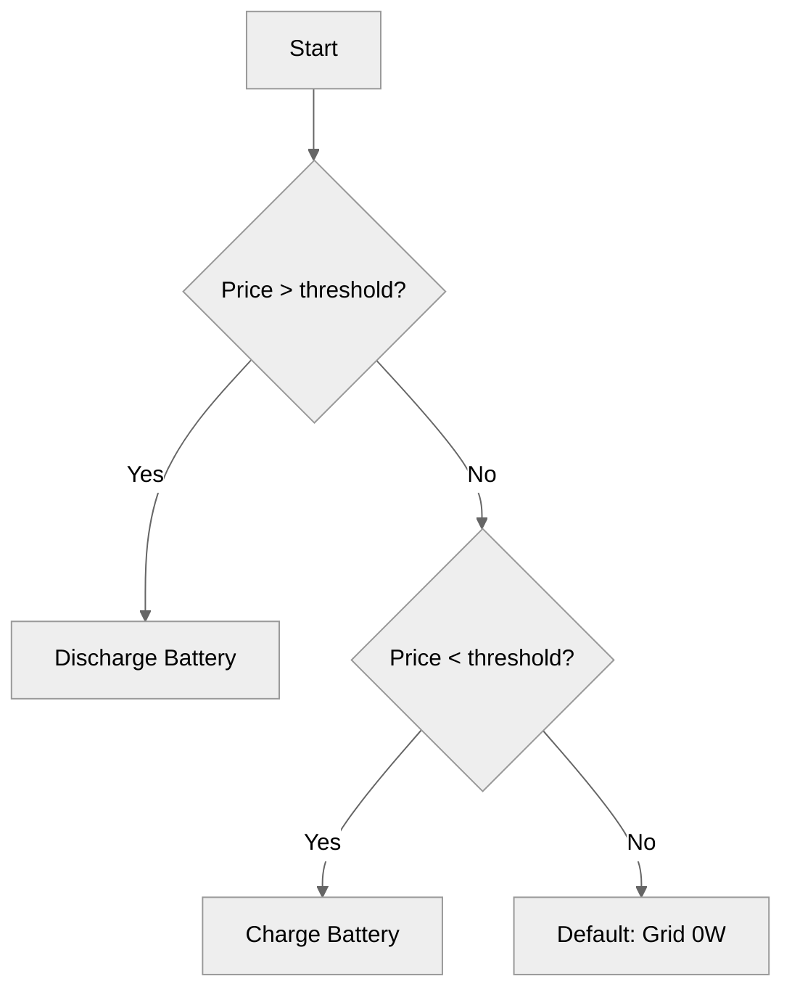

# Documentation Style Guide for AI Agents

**For Typora Editor | Stephen Few Minimal Distraction Principle**

This document provides mandatory rules for AI agents (Vibe, Copilot, etc.) when generating or editing documentation for SessyStrategy HA.

---

## Core Principles

1. **Stephen Few minimal distraction**: Eliminate all non-essential visual elements
2. **Typora native features**: Use Typora's built-in Markdown extensions
3. **Mermaid for diagrams**: Visual explanations via Mermaid with neutral colors
4. **Call-out boxes**: Use `[!note]`, `[!warning]`, `[!caution]` for emphasis

---

## Allowed Elements

| Element | Syntax | Purpose | Example |
|---------|--------|---------|---------|
| Plain headers | `# Header` | Section titles | `# Configuration` |
| Mermaid diagrams | ```mermaid | Visual explanations | See below |
| Call-out note | `[!note]` | Informational | `[!note] Tip:` |
| Call-out warning | `[!warning]` | Important caution | `[!warning] Must:` |
| Call-out caution | `[!caution]` | Risk of error | `[!caution] Risk:` |
| Checklists | `- [x]`, `- [ ]` | Task tracking | `- [x] Done` |
| Fault indicators | `❌`, `⚠️` | Errors/warnings only | `❌ Error:` |
| Bold text | `**text**` | UI elements, keys | `**Save** button` |
| Italic text | `_text_` | Emphasis | `_Important_` |
| Code formatting | `` `text` `` | Code, entities | `` `apps.yaml` `` |
| Tables | Markdown tables | Structured data | See below |
| Horizontal rule | `---` | Section separator | `---` |
| Blockquotes | `>` | Notes, asides | `> Note:` |

---

## Prohibited Elements

| Element | Reason | Example to Avoid |
|---------|--------|------------------|
| All emoji except ❌/⚠️ | Distracting | `📚`, `🎯`, `✅`, `💡` |
| Colored text | Distracting | `<span style="color:red">text</span>` |
| Images (PNG/JPG/SVG) | Use Mermaid instead | `` |
| Custom Unicode icons | Distracting | `✨`, `🔥`, `🎉` |
| Green checkmarks | Use `[x]` instead | `✅` |
| Any decorative formatting | Against minimal principle | `~~strikethrough~~` |
| Headers with emoji | Distracting | `# 📚 Tutorials` |

---

## Mermaid Diagram Guidelines

### Theme
**Always use neutral theme for calm, professional appearance:**

```mermaid
%%{init: {'theme': 'neutral'}}%%
```

### Approved Themes
| Theme | When to Use |
|-------|--------------|
| `neutral` | Default for all diagrams |
| `default` | Acceptable alternative |

### Prohibited Themes
- `forest`
- `dark`
- `base` (without neutral overrides)
- Any custom bright color themes

### Style Requirements
1. **Simple layouts**: Minimal nodes, clear flow
2. **Clear labels**: Descriptive, concise text
3. **Neutral colors**: No bright/primary colors
4. **No decorations**: No unnecessary styling

### Example Diagram



### Custom Colors (Use Sparingly)
If custom colors are absolutely necessary, use muted palette:

```mermaid
%%{init: {'theme': 'base', 'themeVariables': { 
  'primaryColor': '#666666', 
  'primaryTextColor': '#333333', 
  'lineColor': '#999999',
  'secondaryColor': '#cccccc',
  'tertiaryColor': '#e0e0e0'
}}}%%
```

---

## Call-Out Box Usage

Typora renders these as styled boxes. Use for important information that needs visual emphasis.

### When to Use Each

| Call-out | Use Case | Typical Content |
|----------|----------|-----------------|
| `[!note]` | Additional context, tips, background info | "This setting affects all charge cycles" |
| `[!warning]` | Critical information, must-read | "This action cannot be undone" |
| `[!caution]` | Potential pitfalls, risks | "Values above 100% may trigger safety limits" |

### Syntax
```markdown
[!note]
This is a note call-out box. Use for informational content.

[!warning]
This is a warning call-out box. Use for critical information.

[!caution]
This is a caution call-out box. Use for potential risks.
```

### Formatting Inside Call-Outs
- First line can be a brief title/label
- Use standard Markdown formatting
- Keep concise (2-4 lines max)
- No emoji except ❌/⚠️

### Example
```markdown
[!note]
This parameter is only used in winter mode. In summer mode, it is ignored.

[!warning]
Changing `price_discharge` to a very low value may cause the battery to discharge continuously.

[!caution]
Do not set `soc_floor` below 10% without understanding the risks to battery longevity.
```

---

## Header Formatting

### Rules
1. **No emoji** in any header
2. **Capitalize first letter** only (sentence case)
3. **Use ATX style**: `# Header` not `Header
----`
4. **One H1 per document** (the title)
5. **Hierarchical**: Don't skip levels (H2 after H1, H3 after H2)

### Examples
```markdown
# Getting Started  (H1 - document title)

## Prerequisites  (H2)

### Required Entities  (H3)

#### SOC Sensor  (H4 - use sparingly)
```

---

## Table Formatting

### Rules
1. Always include header row
2. Always include separator row (`|---|---|`)
3. Left-align all columns
4. Keep tables narrow (max 5 columns)
5. No emoji in cells
6. Use minimal formatting inside cells

### Example
```markdown
| Parameter | Type | Default | Required | Description |
|-----------|------|---------|----------|-------------|
| soc_sensor | string | - | Yes | Battery SOC entity |
| price_sensor | string | - | Yes | Energy price entity |
```

---

## Code Block Formatting

### Rules
1. **Always specify language** for syntax highlighting
2. **Trim trailing whitespace**
3. **Keep examples minimal** and functional
4. **Use YAML for configuration**
5. **Use bash for commands**

### Examples

```markdown
```yaml
sessy_strategy:
  module: sessy_strategy
  class: SessyStrategy
  soc_sensor: sensor.battery_soc
```

```bash
cp files/sessy_strategy.py /config/appdaemon/apps/
restart appdaemon
```
```

---

## Link Formatting

### Rules
1. **Descriptive text**, never "click here" or URLs
2. **Use relative paths** for internal links
3. **Use full URLs** for external links

### Examples
```markdown
✅ Good: [Configuration Reference](reference/configuration/apps-yaml.md)
✅ Good: [Tune Price Thresholds](how-to/tune-price-thresholds.md)
✅ Good: [Sessy Integration](https://github.com/andrew-codechimp/Sessy)
❌ Bad: [Click here](how-to/tune-price-thresholds.md)
❌ Bad: [https://github.com/andrew-codechimp/Sessy](https://github.com/andrew-codechimp/Sessy)
```

---

## Checklist Formatting

### Rules
1. Use **GitHub-style task lists**: `- [x]` and `- [ ]`
2. **Monochrome only** (no colored checkmarks)
3. **One task per line**
4. **Indentation**: 2 spaces for nested items

### Examples
```markdown
- [x] Install AppDaemon
- [x] Copy strategy file
- [ ] Configure apps.yaml
- [ ] Restart AppDaemon
  - [ ] Verify logs
  - [ ] Check entities
```

---

## Fault and Warning Indicators

### Allowed Indicators
| Indicator | Meaning | When to Use |
|-----------|---------|--------------|
| `❌` | Error, failure, prohibited | "❌ Invalid configuration" |
| `⚠️` | Warning, caution, risk | "⚠️ May cause unexpected behavior" |

### Rules
1. **Only these two emoji** are permitted
2. **Use sparingly** - only when attention is critical
3. **Place at start** of line or after bullet
4. **Follow with space** and description

### Examples
```markdown
- ❌ Do not set both parameters simultaneously
- ⚠️ Values above 100% are clamped to 100%

❌ Error: Entity not found
⚠️ Warning: Default value may not be optimal
```

---

## Document Structure Template

```markdown
---
title: Document Title
description: Brief description of document purpose
author: Your Name
created: YYYY-MM-DD
last_updated: YYYY-MM-DD
---

# Document Title

Clear introduction paragraph explaining the document's purpose.

[!note]
Additional context or prerequisites.

## Section 1

Content here.

### Subsection 1.1

More content.

```mermaid
%%{init: {'theme': 'neutral'}}%%
```

[!warning]
Critical information.

## Section 2

- [x] Completed task
- [ ] Pending task

## Troubleshooting

- ❌ Error condition: Description
- ⚠️ Warning condition: Description

---

*Document metadata and links*
```

---

## Agent System Prompt

**Use this exact prefix for all documentation requests to AI agents:**

```
STYLE: SessyStrategy HA documentation rules.
- Editor: Typora
- Diagrams: Mermaid with %%{init: {'theme': 'neutral'}}%%
- Call-outs: [!note], [!warning], [!caution]
- NO emoji except ❌ (error) and ⚠️ (warning)
- NO colored text
- Headers: plain text only (# Header, not # 📚 Header)
- Checklists: [x] and [ ] only
- Tables: standard Markdown with separator row
- Code blocks: always specify language
- Links: descriptive text, never "click here"

Follow Stephen Few's minimal distraction principle. Violations will be rejected.
```

---

## Quick Reference for Humans

```
□ Headers: #, ##, ### only (plain text, sentence case)
□ Diagrams: Mermaid with neutral theme
□ Call-outs: [!note], [!warning], [!caution]
□ Checklists: [x], [ ] only
□ Faults: ❌ (error), ⚠️ (warning) only
□ NO other emoji
□ NO colored text
□ NO images (use Mermaid)
□ Tables: include header and separator rows
□ Code: specify language
□ Links: descriptive text
```

---

## Migration Guide for Existing Documents

When updating existing documentation:

1. **Remove all emoji** except ❌ and ⚠️
2. **Replace images** with Mermaid diagrams
3. **Add call-out boxes** for important notes
4. **Standardize headers** (remove emoji, use sentence case)
5. **Convert checklists** to `[x]`/`[ ]` format
6. **Add Mermaid theme** spec to all diagrams

---

## Version History

| Date | Change | Author |
|------|--------|--------|
| 2026-08-01 | Initial agent rules created | System |
| 2026-08-01 | Added Typora + Mermaid + call-out guidelines | System |

---

*For questions or clarifications, refer to the main [STYLE_GUIDE.md](STYLE_GUIDE.md).*
