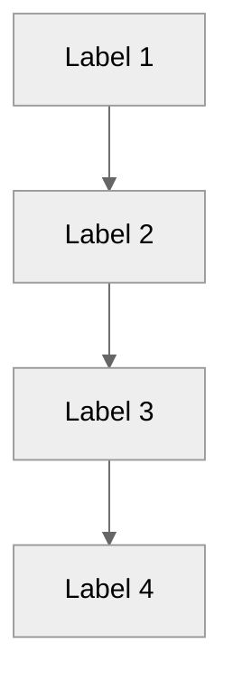

# [Concept Title]

**Category:** Explanation | **Difficulty:** Beginner/Intermediate/Advanced

---

## Concept Overview

### What This Is

[Clear, concise definition of the concept]

### Why It Matters

[Explanation of why understanding this concept is important for using SessyStrategy]

### Key Terms

| Term | Definition |
|------|------------|
| [Term 1] | [Definition] |
| [Term 2] | [Definition] |

---

## Related Documentation

- [Reference document](link) - Technical details
- [How-to guide](link) - Practical application
- [Tutorial](link) - Hands-on learning

---

## Deep Dive

[!note]
This section provides technical depth for those who want to understand the underlying mechanisms.

### [Section 1: Core Concept]

#### How It Works

[Detailed explanation with examples]

```python
# Code example if applicable
```

#### Mathematical Basis (if applicable)

[Formula with explanation]

**Formula:**
```
[mathematical formula]
```

**Where:**
- [Variable 1]: [Description]
- [Variable 2]: [Description]

**Example Calculation:**
```
Given: [inputs]
Calculation: [steps]
Result: [output]
```

---

### [Section 2: Supporting Concept]

[Continue with additional sections]

---

## Visual Representation

[!note]
Diagrams use Mermaid with neutral theme for clarity and professional appearance.

### Diagram



**Diagram Explanation:**
- [Explain what the diagram shows]
- [Explain the flow or relationships]

---

### Example Scenario

**Scenario:** [Description of a realistic example]

**Step-by-step:**
1. [Initial state]
2. [Trigger event]
3. [System response]
4. [Final state]

**Visual Timeline:**
```
Time:     00:00    06:00    12:00    18:00    24:00
SOC:      50%      75%      60%      45%      55%
Price:    €0.20    €0.15    €0.40    €0.35    €0.25
Action:   Charge   Hold     Discharge Hold     Charge
```

---

## Practical Implications

### When This Applies

- [Scenario 1 where this concept is relevant]
- [Scenario 2]
- [Scenario 3]

### When This Doesn't Apply

- [Scenario 1 where this doesn't apply]
- [Scenario 2]

---

## Trade-offs and Considerations

[!caution]
Understand these trade-offs before making configuration changes.

### Advantages

- [x] [Benefit 1 with explanation]
- [x] [Benefit 2 with explanation]

### Limitations

- [ ] [Limitation 1 with explanation]
- [ ] [Limitation 2 with explanation]

### Configuration Impact

| Configuration Option | Effect on Concept | Recommended Value | Notes |
|----------------------|-------------------|-------------------|-------|
| [Option 1] | [Effect] | [Value] | [Notes] |
| [Option 2] | [Effect] | [Value] | [Notes] |

---

## Real-World Examples

### Example 1: [Title]

**Situation:** [Context]

**Application:** [How the concept applies]

**Outcome:** [Result]

---

### Example 2: [Title]

[Repeat structure]

---

## References

- [External reference 1](link) - [Description]
- [External reference 2](link) - [Description]
- [Code implementation](link-to-code) - [Brief description]

---

## Summary

| Aspect | Key Point |
|--------|-----------|
| **What** | [One-sentence summary] |
| **Why** | [Why it's important] |
| **How** | [How it works in practice] |
| **When** | [When it applies] |

---

## Quick Quiz (Self-Assessment)

1. **Question:** [Simple comprehension question]?
   - A) [Option 1]
   - B) [Option 2 - correct]
   - C) [Option 3]
   
   **Answer:** [B - Explanation]

2. **Question:** [Application question]?
   - A) [Option 1 - correct]
   - B) [Option 2]
   
   **Answer:** [A - Explanation]

---

*Last updated: 2026-08-01*
