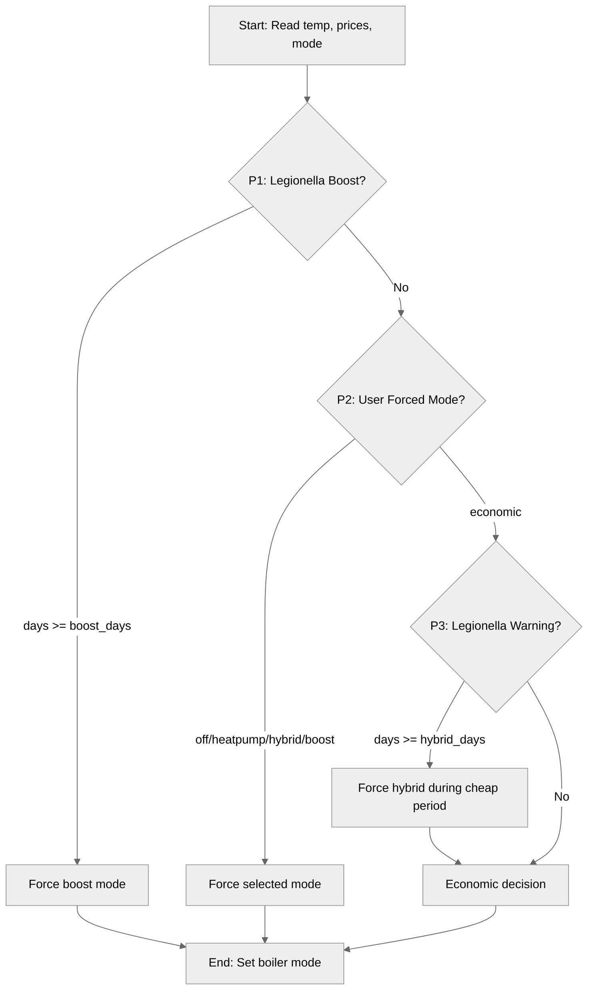
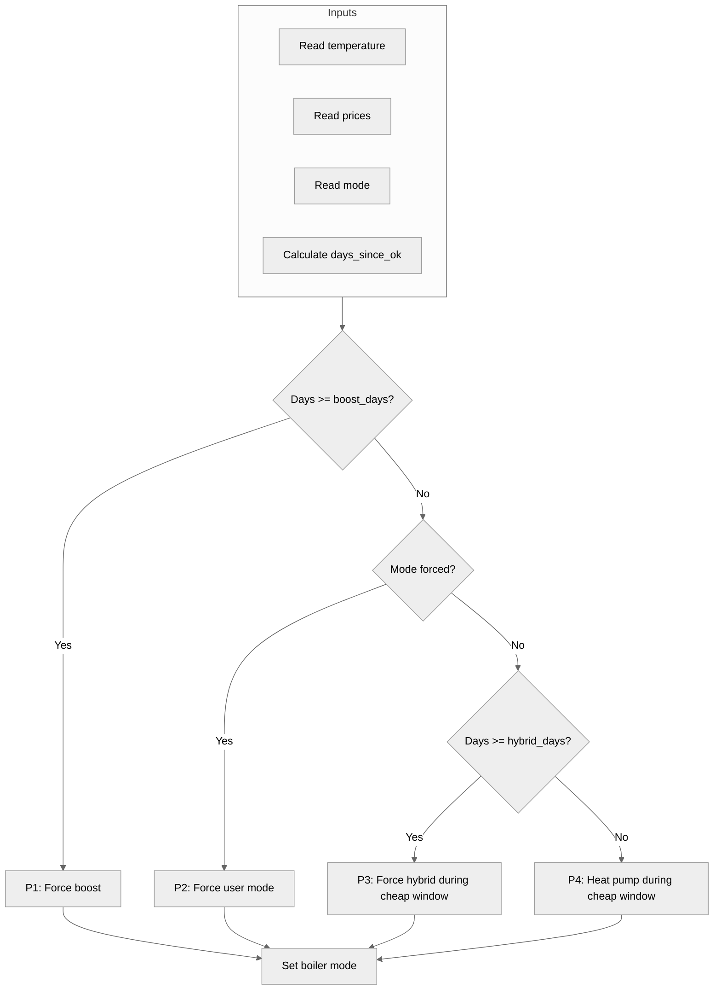

# Boiler Strategy Priority Chain

*Last updated: 2026-09-14 | Part of [Explanation Documentation](../index.md)*

---

## Concept Overview

The Boiler Strategy app makes decisions using a **priority chain** — a sequence of rules evaluated in order, where the first matching rule wins and determines the boiler mode. This approach ensures that critical safety requirements (legionella prevention) always take precedence over economic optimization, while still respecting explicit user preferences.

The chain has four priority levels (P1-P4), evaluated in order every 15 minutes:



---

## Key Terms

| Term | Definition |
|------|------------|
| **Legionella** | Bacteria that can grow in water systems at 20-45°C, posing a health risk. Prevented by regularly heating water to 65°C+. |
| **Legionella Boost** | Full electric heating mode that rapidly raises water temperature to the target. |
| **Legionella Hybrid** | Combined heat pump and electric heating mode, used as a warning stage before full boost. |
| **Economic Mode** | User-selected mode that optimizes for cost by running the heat pump during the cheapest price period. |
| **Days Since Last OK** | Number of days since the boiler last reached `legionella_temp`. Tracked via the `legionella_last_ok_entity`. |

---

## Priority Levels Explained

### P1: Legionella Boost (Safety Critical)

**Condition:** `days_since_ok >= legionella_boost_days AND mode != "off"`

**Action:** Force mode `boost`

**Purpose:** This is the highest-priority safety rule. When the boiler has not reached the legionella prevention temperature (`legionella_temp`, default 65°C) within the configured number of days (`legionella_boost_days`, default 7), the app forces the boiler into boost mode. This ensures the water is heated to a temperature that kills legionella bacteria, regardless of energy costs.

**When it runs:** Always, 24/7, until the temperature target is reached. This overrides any user-selected mode except `off`.

**Example scenario:** The boiler has been in heat pump only mode for a week during mild weather, and the water temperature never exceeded 55°C. On day 7, P1 triggers and forces boost mode until the water reaches 65°C.

!!! warning
    This rule cannot be overridden by economic considerations. If you want to disable legionella prevention entirely, you must manually select `off` mode, which disables P1.

### P2: User Forced Mode

**Condition:** `mode` is `off`, `heatpump`, `hybrid`, or `boost`

**Action:** Force the selected mode directly

**Purpose:** When the user explicitly selects a specific boiler mode (not `economic`), that mode takes effect immediately and unconditionally. This gives users full manual control when needed.

**When it runs:** Immediately, on every cycle, as long as the user has not selected `economic`.

**Mode behaviors:**
- **`off`**: Boiler stays off, no heating. Also disables P1 (legionella boost).
- **`heatpump`**: Uses only the heat pump for heating.
- **`hybrid`**: Uses both heat pump and electric heating.
- **`boost`**: Uses full electric heating for rapid temperature increase.

**Example scenario:** User notices cold weather approaching and manually selects `hybrid` mode to ensure adequate heating. P2 enforces this regardless of price or legionella status.

### P3: Legionella Warning (Hybrid Escalation)

**Condition:** `mode == "economic" AND days_since_ok >= legionella_hybrid_days`

**Action:** Force mode `hybrid` during the cheapest configured period

**Purpose:** This is a warning stage that activates when the boiler has not reached `legionella_temp` within `legionella_hybrid_days` (default 6). Unlike P1, this only forces hybrid mode during the cheaper of the two economic windows, balancing safety with cost optimization.

**When it runs:** Only when the user has selected `economic` mode AND the current time falls within the cheapest configured window (day or night).

**Example scenario:** It's day 6 since the last legionella prevention, user is in `economic` mode. If the night period (00:00-06:00) has cheaper prices than the day period (10:00-16:00), the boiler will run in hybrid mode only during 00:00-06:00. Outside that window, the boiler stays off.

!!! note
    This rule only applies when in `economic` mode. If the user has selected a specific mode (P2), this rule is skipped entirely.

### P4: Economic Price Decision

**Condition:** Default fallback when no higher-priority rule matches

**Action:** Run the heat pump only during the cheaper of the two configured windows; stay off otherwise

**Purpose:** When no safety or user override conditions apply, the app optimizes for cost by comparing the average forecast price of the two configured periods (day and night) and running the heat pump only during the cheaper one.

**When it runs:** When mode is `economic` and legionella prevention is not yet required (P3 condition not met).

**How it works:**
1. Reads the price forecast from `price_forecast_sensor`
2. Calculates average price for `economic_day_start` to `economic_day_end` (default 10:00-16:00)
3. Calculates average price for `economic_night_start` to `economic_night_end` (default 00:00-06:00)
4. Compares the two averages
5. Runs heat pump during the cheaper window; stays off during the expensive window

**Example scenario:** Day prices average €0.40/kWh, night prices average €0.15/kWh. The app runs the heat pump during 00:00-06:00 and stays off during 10:00-16:00.

---

## Practical Implications

### Safety First

The priority chain is designed so that **safety always wins**. Legionella prevention (P1 and P3) takes precedence over economic optimization. This means:

- If your boiler hasn't been hot enough for 7 days, it WILL heat up, even during expensive hours (P1)
- If your boiler hasn't been hot enough for 6 days, it WILL run in hybrid mode during cheap hours (P3)
- These rules cannot be overridden by price considerations

### User Control

The user always has ultimate control through P2:

- Selecting `off` disables all heating (including legionella prevention)
- Selecting `boost`, `hybrid`, or `heatpump` forces that mode regardless of price or legionella status
- Only `economic` mode allows the app to make cost-optimized decisions

### Escalation Path

The legionella prevention system has a two-stage escalation:

```
Day 0-5: Normal operation (economic or user mode)
Day 6:   Hybrid mode during cheap periods only (P3)
Day 7:   Boost mode always (P1)
```

This gives a 24-hour warning period (day 6) where the boiler runs in hybrid mode during cheap hours, before forcing the more expensive full boost on day 7.

### Economic Mode Behavior

When in `economic` mode (the default), the app:

1. First checks if legionella boost is needed (P1) → if yes, boost always
2. Then checks if user forced a mode (P2) → N/A in economic mode
3. Then checks if legionella warning is needed (P3) → if yes, hybrid during cheap window
4. Finally, runs heat pump during cheaper window (P4)

This means that even in economic mode, safety requirements will cause the boiler to run at suboptimal times if necessary.

---

## Decision Flow Diagram



---

## Configuration Impact on Priority Chain

The priority chain behavior can be tuned through configuration:

| Config Parameter | Affects Priority | Impact |
|------------------|-----------------|--------|
| `legionella_temp` | P1, P3 | Changes the temperature threshold for legionella tracking |
| `legionella_boost_days` | P1 | Changes when full boost is forced (default: 7) |
| `legionella_hybrid_days` | P3 | Changes when hybrid warning activates (default: 6) |
| `economic_day_start/end` | P3, P4 | Defines the day window for economic comparison |
| `economic_night_start/end` | P3, P4 | Defines the night window for economic comparison |

---

## Common Scenarios

### Scenario 1: Weekly Legionella Cycle

- **Setup:** Default configuration, economic mode, boiler reaches 65°C every Sunday
- **Week behavior:** P4 runs heat pump during cheap hours
- **Day 6 (Saturday):** P3 activates, hybrid during cheap hours
- **Day 7 (Sunday):** P1 would activate, but the weekly heating cycle on Sunday keeps resetting the timer

### Scenario 2: Manual Override

- **Setup:** User selects `hybrid` mode on a cold day
- **Behavior:** P2 enforces hybrid mode continuously, regardless of price or legionella status
- **Result:** Boiler runs in hybrid mode 24/7 until user changes mode

### Scenario 3: Price Spike During Legionella Warning

- **Setup:** Day 6 since last legionella prevention, expensive day prices, cheap night prices, economic mode
- **Behavior:** P3 activates, but only during cheap night window. During expensive day window, boiler stays off (not yet at P1 threshold)
- **Result:** Legionella prevention happens during cheap hours, next day resets to P4

---

## See Also

- [Boiler Strategy Configuration Reference](../reference/configuration/boiler-strategy-config.md) — All configuration options
- [Entity Reference](../reference/entity-reference.md) — Entities used by the boiler strategy
- [Strategy Priority Chain](strategy-priority-chain.md) — Main SessyStrategy priority chain (battery strategy)
