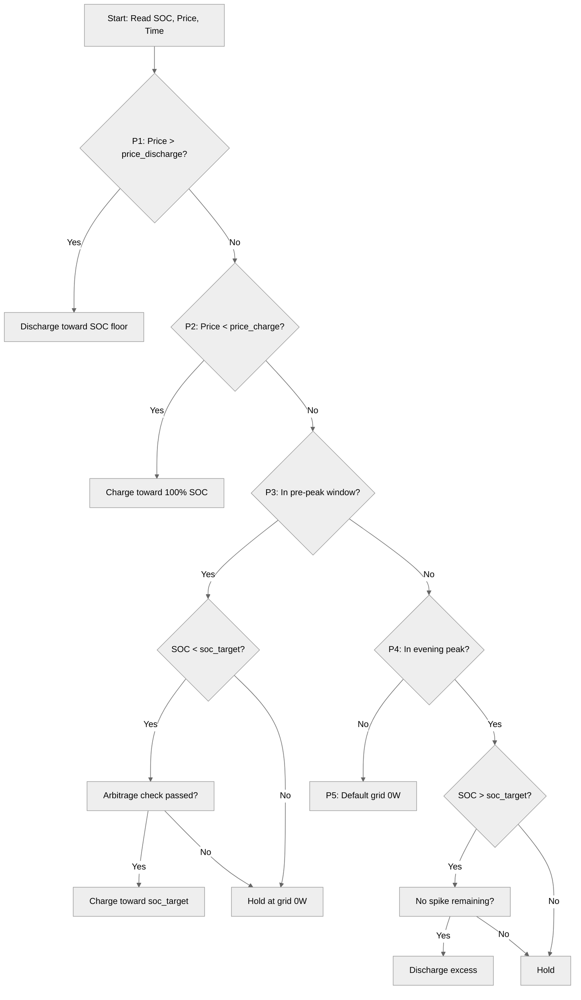

# Strategy Priority Chain

## Overview

The SessyStrategy uses a **top-down priority chain** to determine the optimal battery behavior. The strategy evaluates conditions in order from Priority 1 (highest) to Priority 5 (lowest). The **first matching condition wins**, sets the appropriate setpoint, and stops evaluation — subsequent priorities are skipped. This creates a self-correcting system that re-evaluates every 5 minutes (or immediately when live inputs change).

**Key principles:**
- Top-down evaluation: highest priority conditions are checked first
- First match wins: only one priority branch executes per cycle
- Self-correcting: decisions are recomputed from scratch each run
- No state persistence: the strategy behaves like a proportional controller

The priority chain is designed to capture the most valuable opportunities first while providing safe, efficient defaults for all other situations.

---

## Priority Flow Diagram



---

## Priority 1: Price-Spike Discharge

### When It Triggers

**Condition:** `raw_price > price_discharge`

- Default threshold: €0.39/kWh (raw export price)
- Import equivalent: €0.50/kWh (raw + €0.11 surcharge)
- Compares current hour's raw price against the configured threshold

**Example:** 
- Raw price = €0.46/kWh
- `price_discharge` = €0.39/kWh
- Import price = €0.57/kWh
- **Result:** Trigger fires, battery discharges

### What It Does

1. **Determines spread window:** Calculates how many contiguous hours the price stays above threshold (minimum `min_window_h` = 2 hours)
2. **Calculates discharge power:** Spreads available energy above `soc_floor` over the window
3. **Sets battery setpoint:** Uses `api` mode (direct battery power control)

**Formula:**
```
available_wh = (soc - soc_floor) / 100 × capacity_wh
spread_w = available_wh / window_h
discharge_w = max(50, min(spread_w, max_power_w))
```

**Parameters:**
- `soc_floor`: Minimum SOC level (default: 0%, winter: configurable)
- `min_window_h`: Minimum spread window in hours (default: 2.0)
- `max_power_w`: Maximum inverter power (default: 2200W)

### Why It's Priority #1

**Rationale:** The single most valuable action a home battery can take is **avoiding expensive grid imports**. During price spikes (typically evening peaks), discharging stored energy:

- Sells stored energy at high prices
- Avoids importing expensive grid power
- Captures maximum financial benefit with minimal complexity

**Lean design:** One simple price comparison (`raw_price > price_discharge`) captures ~90% of the optimization value without forecasting, optimization algorithms, or complex state management.

**Efficiency:** The adaptive window keeps the inverter in its efficient operating range. Since copper losses scale with the square of current, operating at half power is approximately 4× more efficient per watt than full power.

---

## Priority 2: Cheap/Negative Price Charge

### When It Triggers

**Condition:** `raw_price < price_charge`

- Default threshold: -€0.10/kWh (raw export price)
- Import equivalent: €0.01/kWh (raw + €0.11 surcharge)
- Only fires when SOC < `cheap_soc_target` (default: 100%)

**Example:**
- Raw price = -€0.14/kWh (grid pays you to consume)
- `price_charge` = -€0.10/kWh
- **Result:** Trigger fires, battery charges from grid

### What It Does

1. **Determines spread window:** Calculates how many contiguous hours the price stays below threshold (minimum `min_window_h`)
2. **Sets charge power:** Always charges at `max_power_w` when below `cheap_soc_target`
3. **Sets battery setpoint:** Uses `api` mode (direct battery power control), negative = charge

**Formula:**
```
window_h = max(contiguous_hours_price_below_threshold, min_window_h)
charge_w = max_power_w  (when soc < cheap_soc_target)
```

**Parameters:**
- `cheap_soc_target`: Target SOC for cheap charging (default: 100%)
- `max_power_w`: Maximum charge power (default: 2200W)

### Why It's Priority #2

**Rationale:** Capturing cheap or negative-price energy provides **double savings**:

1. **Cheap in:** Energy is purchased at very low (or negative) cost
2. **Expensive out:** That stored energy can later replace expensive grid imports

**Lean design:** This primarily benefits **winter operation** when:
- Deeply negative prices are rare
- Ordinary cheap prices occur overnight (exactly when PV is unavailable)
- The battery needs filling for the day ahead

**Design choice:** We deliberately **do not** optimize for rare extreme-negative events (e.g., -€0.50/kWh) because:
- Maximizing these would require pre-emptively dumping stored energy
- Would need curtailing PV generation at peak production
- Complex strategy for rare payoff doesn't justify the added complexity

---

## Priority 3: Pre-Peak Charge Window

### When It Triggers

**Conditions (all must be true):**
1. Current hour is within `prepeak_start` to `prepeak_end` (default: 16:00-18:00, winter: 14:00-18:00)
2. SOC < `soc_target` (default: 70%)
3. **Arbitrage guard passes:** `expected_peak_raw - current_raw_price >= min_arbitrage_margin`

**Example:**
- Current hour: 16:30
- Current raw price: €0.15/kWh
- Expected peak (max remaining price today): €0.50/kWh
- `min_arbitrage_margin`: €0.05/kWh
- Spread: €0.50 - €0.15 = €0.35 > €0.05
- **Result:** Trigger fires, battery charges

### What It Does

1. **Finds expected peak:** Scans remaining hours of the day for maximum raw price
2. **Checks arbitrage margin:** Ensures the peak is sufficiently higher than current price
3. **Calculates charge power:** Spreads SOC gap over `prepeak_window_h`
4. **Sets battery setpoint:** Uses `api` mode (direct battery power control), negative = charge

**Formula:**
```
gap_wh = (soc_target - soc) / 100 × capacity_wh
spread_w = gap_wh / prepeak_window_h
power_w = spread_w × 1.5  (charge 50% faster than even spread)
charge_w = max(min_power_w, min(power_w, max_power_w))
```

**Parameters:**
- `prepeak_start`: Start of pre-peak window (hours)
- `prepeak_end`: End of pre-peak window (hours)
- `prepeak_window_h`: Spread window for charging (default: 2h, winter: 4h)
- `soc_target`: Target SOC to reach (default: 70%)
- `min_arbitrage_margin`: Minimum price spread to justify charging (default: €0.05/kWh)
- `min_power_w`: Minimum power threshold (66% of max_power_w)

### Why It's Priority #3

**Rationale:** On dull days when solar cannot fill the battery, a **grid top-up** is the only way to have stored energy ready for expensive evening hours. However, this must be carefully controlled:

**The break-even guard is critical:**
- Buying at €0.46 to discharge at €0.47 barely breaks even after losses
- The `min_arbitrage_margin` prevents churning the battery for minimal gain

**Lean design:** One max-lookup over the day's remaining prices provides cheap insurance against uneconomic charging, without requiring a full arbitrage optimizer.

**Seasonal note:** In winter, this branch is more active because:
- Lower PV generation means less natural charging
- Higher heating loads increase energy demand
- The winter-specific `prepeak_window_h` (4h vs 2h) allows gentler charging

---

## Priority 4: Evening Peak Excess Discharge

### When It Triggers

**Conditions (all must be true):**
1. Current hour is within `evening_peak_start` to `evening_peak_end` (default: 20:00-22:00)
2. SOC > `soc_target` (default: 70%)
3. No remaining hour today exceeds `price_discharge` (no more spikes to save energy for)

**Example:**
- Current hour: 21:00
- SOC: 95%
- `soc_target`: 70%
- Max remaining price: €0.25/kWh
- `price_discharge`: €0.39/kWh
- **Result:** Trigger fires, excess SOC is discharged

### What It Does

1. **Calculates remaining peak time:** Hours until `evening_peak_end`
2. **Calculates excess energy:** SOC above `soc_target`
3. **Sets grid setpoint:** Uses `nom` mode (grid meter target), negative = export

**Formula:**
```
gap_wh = (soc - soc_target) / 100 × capacity_wh
spread_w = gap_wh / max(hours_remaining, 0.083)  # avoid division by zero
discharge_w = max(50, min(spread_w, max_power_w))
```

**Important behavior:** Using grid setpoint (not battery setpoint) means:
- The battery covers household load **on top of** the export target
- A high home load makes the battery work harder rather than importing from the grid
- The battery never imports to top up; it only provides the export and covers house demand

### Why It's Priority #4

**Rationale:** Holding charge past the target SOC only pays if a **bigger peak is still ahead**. Once the schedule indicates there are no more price spikes worth saving energy for:

- The excess energy is worth more **used now** than carried overnight
- Discharging at moderate prices is better than storing energy that may not be used optimally

**Lean design:** A single scan of remaining prices provides cheap insurance against ending the day overcharged.

---

## Priority 5: Default

### When It Triggers

**Condition:** None of the above priorities match (fall-through)

This covers the **bulk of the day** — typically daytime hours with moderate prices and active solar generation.

### What It Does

**Sets grid setpoint:** Uses `nom` mode with 0W target

**Behavior:**
- Grid meter target = 0W
- All PV generation is **forced into the battery first**
- Grid export is **blocked** until battery is full
- Any household load shortfall is covered by the grid

### Why It's the Default

**Rationale:** This is the **safe, do-no-harm** default because:

- **Efficiency:** Exporting solar and re-importing it later pays the €0.11/kWh surcharge twice
- **Self-consumption:** Holding the meter at 0W prioritizes using PV energy directly
- **Cost:** Solar energy is almost always the cheapest kWh available

**Lean design:** The chain only ever leaves this default for a **concrete, priced reason**. Most hours of the day will use this priority.

---

## Priority Summary Table

| Priority | Name | Trigger Condition | Setpoint Type | Mode | Primary Benefit |
|----------|------|-------------------|---------------|------|-----------------|
| 1 | Price-spike discharge | raw_price > price_discharge | Battery | api | Avoid expensive imports |
| 2 | Cheap price charge | raw_price < price_charge | Battery | api | Capture cheap energy |
| 3 | Pre-peak charge | In pre-peak window + SOC < target + arbitrage margin met | Battery | api | Prepare for evening peak |
| 4 | Evening peak excess | In evening peak + SOC > target + no spikes remaining | Grid | nom | Monetize excess SOC |
| 5 | Default | None of above | Grid | nom | Maximize self-consumption |

---

## See Also

- [Price Basis: Raw vs Import](../explanation/price-basis-raw-vs-import.md) — Understanding the price calculations
- [Adaptive Spread Windows](../explanation/adaptive-spread-windows.md) — How window sizes are calculated
- [Setpoint Types Explained](../explanation/setpoint-types-explained.md) — api vs nom modes
- [Arbitrage Margin](../explanation/arbitrage-margin.md) — The P3 break-even logic
- [Seasonal Operation](../explanation/seasonal-operation.md) — How seasons affect priorities
- [apps.yaml Configuration](../reference/configuration/apps-yaml.md) — All tunable parameters
