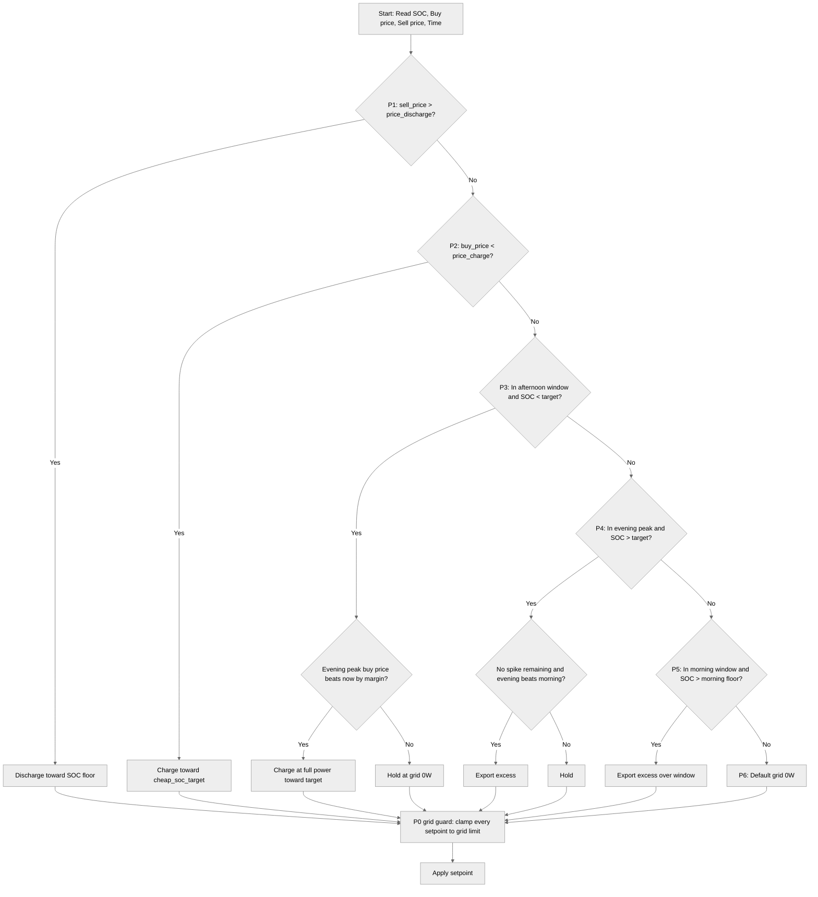

# Strategy Priority Chain

## Overview

The SessyStrategy uses a **top-down priority chain** to determine the optimal battery behavior. The strategy evaluates conditions in order from Priority 1 (highest) to Priority 6 (lowest). The **first matching condition wins**, sets the appropriate setpoint, and stops evaluation — subsequent priorities are skipped. A **grid-connection guard (Priority 0)** then clamps every resulting setpoint to the safe grid power before it is applied. This creates a self-correcting system that re-evaluates every 5 minutes (or immediately when live inputs change).

**Key principles:**
- Top-down evaluation: highest priority conditions are checked first
- First match wins: only one priority branch executes per cycle
- Grid guard always applies: every setpoint is clamped to the grid limit (P0)
- Buy/sell split: charging decisions use the **buy** price, discharging decisions use the **sell** price
- Each rule is individually switchable from the GUI
- Self-correcting: decisions are recomputed from scratch each run
- No state persistence: the strategy behaves like a proportional controller

The priority chain is designed to capture the most valuable opportunities first while providing safe, efficient defaults for all other situations.

---

## Priority Flow Diagram



---

## Priority 0: Grid-Connection Guard

### When It Applies

**Always.** This is not a branch that "wins" — it is a final safety clamp applied to **every** setpoint that any other priority produces, right before it is sent to the hardware.

### What It Does

Clamps the commanded power to the safe grid limit in both directions (import and export):

**Formula:**
```
grid_limit_w = max_grid_w × grid_utilization         # default 8000 × 0.9 = 7200W
# Grid (nom) setpoints:
clamped = max(-grid_limit_w, min(watts, grid_limit_w))
# Battery (api) setpoints — also bounded by the inverter:
limit   = min(grid_limit_w, max_power_w)
clamped = max(-limit, min(watts, limit))
```

**Parameters:**
- `max_grid_w`: Physical grid-connection limit in W (default: 8000)
- `grid_utilization`: Safety margin fraction of the connection (default: 0.9)

### Why It's Priority #0

**Rationale:** No optimization decision may ever push more power through the connection than it can safely carry. Because the guard is centralised, every branch below can compute its ideal setpoint without worrying about connection limits — the clamp is the single place that enforces them.

---

## Priority 1: Price-Spike Discharge

### When It Triggers

**Condition:** `sell_price > price_discharge`

- Default threshold: €0.39/kWh (export/sell price)
- Compares the current hour's **sell** price against the configured threshold
- Rule can be disabled from the GUI (`rule_price_spike`)

**Example:**
- Sell price = €0.46/kWh
- `price_discharge` = €0.39/kWh
- **Result:** Trigger fires, battery discharges

### What It Does

1. **Determines spread window:** Calculates how many contiguous hours the sell price stays above threshold (minimum `min_window_h`)
2. **Calculates discharge power:** Spreads available energy above `soc_floor` over the window
3. **Sets battery setpoint:** Uses `api` mode (direct battery power control)

**Formula:**
```
available_wh = (soc - soc_floor) / 100 × capacity_wh
spread_w = available_wh / window_h
discharge_w = max(50, min(spread_w, max_power_w))
```

**Parameters:**
- `soc_floor`: Minimum SOC level (default: 0%, winter: configurable)
- `min_window_h`: Minimum spread window in hours (default: 2.0)
- `max_power_w`: Maximum inverter power (default: 2200W)

### Why It's Priority #1

**Rationale:** The single most valuable action a home battery can take is **selling into an expensive peak** (and avoiding expensive imports at the same time). During price spikes (typically evening peaks), discharging stored energy captures maximum financial benefit with minimal complexity.

**Lean design:** One simple price comparison (`sell_price > price_discharge`) captures the bulk of the optimization value without forecasting or complex state management.

**Efficiency:** The adaptive window keeps the inverter in its efficient operating range. Since copper losses scale with the square of current, operating at half power is approximately 4× more efficient per watt than full power.

---

## Priority 2: Cheap/Negative Price Charge

### When It Triggers

**Condition:** `buy_price < price_charge`

- Default threshold: €0.01/kWh (import/buy price)
- Only charges while SOC < `cheap_soc_target` (default: 100%); at or above the ceiling it holds grid 0W
- Rule can be disabled from the GUI (`rule_cheap_charge`)

**Example:**
- Buy price = -€0.05/kWh (grid pays you to consume)
- `price_charge` = €0.01/kWh
- **Result:** Trigger fires, battery charges from grid

### What It Does

1. **Determines spread window:** Calculates how many contiguous hours the buy price stays below threshold (minimum `min_window_h`)
2. **Sets charge power:** Charges at `max_power_w` while below `cheap_soc_target`
3. **Sets battery setpoint:** Uses `api` mode (direct battery power control), negative = charge

**Formula:**
```
window_h = max(contiguous_hours_buy_price_below_threshold, min_window_h)
charge_w = max_power_w  (when soc < cheap_soc_target)
```

**Parameters:**
- `cheap_soc_target`: Target SOC for cheap charging (default: 100%)
- `max_power_w`: Maximum charge power (default: 2200W)

### Why It's Priority #2

**Rationale:** Capturing cheap or negative-price energy provides **double savings**:

1. **Cheap in:** Energy is purchased at very low (or negative) cost
2. **Expensive out:** That stored energy can later replace expensive grid imports

**Lean design:** This primarily benefits **winter operation**, when ordinary cheap prices occur overnight (exactly when PV is unavailable) and the battery needs filling for the day ahead.

**Design choice:** We deliberately **do not** optimize for rare extreme-negative events, because maximizing them would require pre-emptively dumping stored energy and curtailing PV — a complex strategy for a rare payoff.

---

## Priority 3: Afternoon Charge Window

### When It Triggers

**Conditions (all must be true):**
1. Current hour is within `afternoon_start` to `afternoon_end` (default: 16:00-18:00, winter: 14:00-18:00)
2. SOC < `target_afternoon_charging` (default: 70%)
3. **Peak-shaving guard passes:** `evening_peak_buy_price - current_buy_price >= afternoon_margin`

**Example:**
- Current hour: 16:30
- Current buy price: €0.26/kWh (import)
- Highest **buy** price during the evening peak window: €0.61/kWh (import)
- `afternoon_margin`: €0.05/kWh
- Reduction: €0.61 - €0.26 = €0.35 >= €0.05
- **Result:** Trigger fires, battery charges at full power

### What It Does

1. **Finds the evening peak import price:** Scans the evening peak window (`evening_peak_start` to `evening_peak_end`) for the highest **buy/import** price
2. **Checks the peak-shaving margin:** Ensures that the evening peak import price beats the current import price by at least `afternoon_margin`
3. **Charges at full power:** Drives the battery at `max_power_w` until `target_afternoon_charging` is reached
4. **Sets battery setpoint:** Uses `api` mode (direct battery power control), negative = charge

**Formula:**
```
evening_peak_buy = max(buy price over evening_peak_start..evening_peak_end)
if evening_peak_buy - current_buy_price < afternoon_margin:  hold grid 0W
else:                                                        charge_w = max_power_w
```

**Parameters:**
- `afternoon_start` / `afternoon_end`: Afternoon window (hours; winter values available)
- `target_afternoon_charging`: Target SOC to reach before the peak (default: 70%)
- `afternoon_margin`: Minimum import-price reduction to justify charging (default: €0.05/kWh)
- `max_power_w`: Charge power once the guard passes (default: 2200W)

### Why It's Priority #3

**Rationale:** On dull days when solar cannot fill the battery, a **grid top-up** is the only way to have stored energy ready for the expensive evening hours. Charging at full power maximises the SOC reached within the (possibly short) window.

**Peak-shaving, not trading:** Both prices compared are **buy/import** prices (raw + surcharge). The rule tops up self-consumed energy at a low afternoon import price to avoid a more expensive grid import during the evening peak. It is explicitly **not** grid trading — when trading, export taxes and fees paid are a loss, so this rule only manages energy you will consume yourself. The separate `min_arbitrage_margin` governs the Priority 4 evening peak hold-vs-sell (trading) decision.

**The peak-shaving guard is critical:** charging now only pays off if the avoided evening import is meaningfully more expensive than the current import. The `afternoon_margin` prevents topping up for a negligible import-price reduction after round-trip losses.

**Seasonal note:** In winter this branch is more active (lower PV, higher loads) and the window opens earlier.

---

## Priority 4: Evening Peak Sell-off Discharge

### When It Triggers

**Conditions (all must be true):**
1. Current hour is within `evening_peak_start` to `evening_peak_end` (default: 20:00-22:00)
2. SOC > `target_peak_discharge` (default: 70%)
3. No remaining hour today has a sell price above `price_discharge` (no more spikes to save energy for)
4. **Evening beats morning:** either there is no known morning peak tomorrow, or `sell_price >= morning_peak - min_arbitrage_margin`

**Example:**
- Current hour: 21:00, SOC: 95%, `target_peak_discharge`: 70%
- Max remaining sell price today: €0.25/kWh (< `price_discharge` €0.39 → no spike)
- Current sell price: €0.30/kWh; tomorrow's morning peak: €0.28/kWh
- Evening (€0.30) ≥ morning (€0.28) − margin → **Result:** export the excess now

### What It Does

1. **Calculates remaining peak time:** Hours until `evening_peak_end`
2. **Calculates excess energy:** SOC above `target_peak_discharge`, floored at 500W
3. **Sets grid setpoint:** Uses `nom` mode (grid meter target), negative = export

**Formula:**
```
gap_wh = (soc - target_peak_discharge) / 100 × capacity_wh
spread_w = gap_wh / max(hours_remaining, 0.083)  # avoid division by zero
discharge_w = max(500, min(spread_w, max_power_w))
```

**Morning reserve behavior:** If tomorrow's morning peak is clearly better than the current evening sell price, the branch does **not** fire — the battery holds its charge so the morning sell-off (Priority 5) can capture the better price. This prevents dumping everything in the evening only to be short in the morning. Because the branch only ever exports the excess **above** `target_peak_discharge`, a reserve is always kept regardless.

**Important behavior:** Using the grid setpoint (not the battery setpoint) means the battery covers household load **on top of** the export target and never imports to top up.

### Why It's Priority #4

**Rationale:** Holding charge past the target SOC only pays if a **bigger sell opportunity is still ahead** — either later today (a spike) or tomorrow morning. Once neither is true, the excess is worth more used now than carried overnight.

---

## Priority 5: Morning Sell-Off

### When It Triggers

**Conditions (all must be true):**
1. Current hour is within `morning_selloff_start` to `morning_selloff_end` (default: 07:00-09:00)
2. SOC > `target_morning_soc` (default: 30%)
3. Rule can be disabled from the GUI (`rule_morning_selloff`)

**Example:**
- Current hour: 08:00, SOC: 80%, `target_morning_soc`: 30%
- **Result:** Trigger fires, the excess above 30% is exported across the remaining morning window

### What It Does

1. **Calculates remaining window time:** Hours until `morning_selloff_end`
2. **Calculates excess energy:** SOC above `target_morning_soc`, floored at 500W
3. **Sets grid setpoint:** Uses `nom` mode (grid meter target), negative = export

**Formula:**
```
gap_wh = (soc - target_morning_soc) / 100 × capacity_wh
spread_w = gap_wh / max(hours_remaining, 0.083)
discharge_w = max(500, min(spread_w, max_power_w))
```

### Why It's Priority #5

**Rationale:** The morning peak is often the counterpart to the evening peak. Priority 4 deliberately holds charge back when the morning is the better sell moment; Priority 5 is where that reserved energy is actually sold. It runs **purely on time and SOC** (no price threshold) — the reserve was already set aside by P4's evening-vs-morning comparison, so once the morning window arrives the excess above `target_morning_soc` is sold and the battery is emptied down to the floor before the solar day begins.

---

## Priority 6: Default

### When It Triggers

**Condition:** None of the above priorities match (fall-through)

This covers the **bulk of the day** — typically daytime hours with moderate prices and active solar generation.

### What It Does

**Sets grid setpoint:** Uses `nom` mode with 0W target

**Behavior:**
- Grid meter target = 0W
- All PV generation is **forced into the battery first**
- Grid export is **blocked** until battery is full
- Any household load shortfall is covered by the grid

### Why It's the Default

**Rationale:** This is the **safe, do-no-harm** default because:

- **Efficiency:** Exporting solar and re-importing it later pays the surcharge twice
- **Self-consumption:** Holding the meter at 0W prioritizes using PV energy directly
- **Cost:** Solar energy is almost always the cheapest kWh available

**Lean design:** The chain only ever leaves this default for a **concrete, priced reason**. Most hours of the day will use this priority.

---

## Priority Summary Table

| Priority | Name | Trigger Condition | Setpoint Type | Mode | Primary Benefit |
|----------|------|-------------------|---------------|------|-----------------|
| 0 | Grid-connection guard | Always (final clamp) | Both | — | Never exceed the grid limit |
| 1 | Price-spike discharge | sell_price > price_discharge | Battery | api | Sell into peaks / avoid imports |
| 2 | Cheap price charge | buy_price < price_charge | Battery | api | Capture cheap energy |
| 3 | Afternoon charge | In afternoon window + SOC < target_afternoon_charging + afternoon margin met | Battery | api | Prepare for evening peak |
| 4 | Evening peak sell-off | In evening peak + SOC > target_peak_discharge + no spikes remaining + evening beats morning | Grid | nom | Monetize excess SOC, reserve for morning |
| 5 | Morning sell-off | In morning window + SOC > target_morning_soc | Grid | nom | Sell the reserved morning energy |
| 6 | Default | None of above | Grid | nom | Maximize self-consumption |

---

## Parameter Rename Summary

The single `soc_target` was split into three purpose-specific targets, and buy/sell prices are now read separately:

| Old | New | Used by |
|-----|-----|---------|
| `soc_target` | `target_afternoon_charging` | Priority 3 (charge target) |
| `soc_target` | `target_peak_discharge` | Priority 4 (evening discharge floor) |
| `soc_target` | `target_morning_soc` | Priority 5 (morning sell-off floor) |
| `raw_price` / `import_price` | `buy_price` / `sell_price` | Charging uses buy, discharging uses sell |

New parameters: `max_grid_w`, `grid_utilization` (P0), `morning_selloff_start`, `morning_selloff_end` (P5). Each rule (P1–P5) has a GUI switch (`rule_price_spike`, `rule_cheap_charge`, `rule_afternoon_charge`, `rule_evening_peak`, `rule_morning_selloff`) that defaults to on.

---

## See Also

- [Price Basis: Raw vs Import](../explanation/price-basis-raw-vs-import.md) — Understanding the price calculations
- [Adaptive Spread Windows](../explanation/adaptive-spread-windows.md) — How window sizes are calculated
- [Setpoint Types Explained](../explanation/setpoint-types-explained.md) — api vs nom modes
- [Arbitrage Margin](../explanation/arbitrage-margin.md) — The P3 break-even logic
- [Seasonal Operation](../explanation/seasonal-operation.md) — How seasons affect priorities
- [apps.yaml Configuration](../reference/configuration/apps-yaml.md) — All tunable parameters
